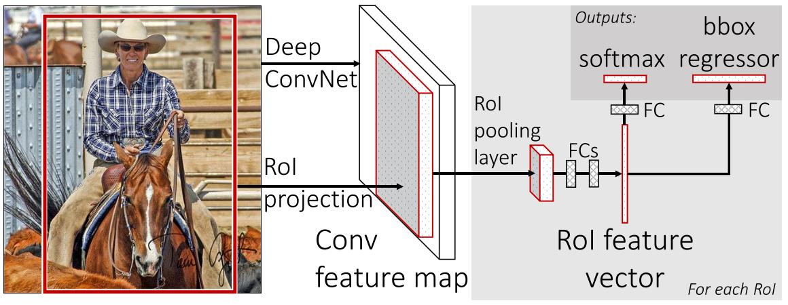

Fast R-CNN
=======================================

| **Authors:** Ross Girshick
| **Affiliations:** Microsoft Research

This paper proposes a Fast Region-Based Convolutional Neural Network method (Fast R-CNN) for object detection, which improves training and testing speed and increases detection accuracy compared to R-CNN.

The author points out three drawbacks of R-CNN:

1. **Training is a multi-stage pipeline.**
2. **Training is expensive in space and time.**
3. **Object detection is slow.**

R-CNN is slow becuase it performs a ConvNet forward pass for each object proposal. Spatial pyramid pooling networks (SPPnets) were proposed to speed up R-CNN by sharing computation. Features are extracted for a proposal by max-pooling the portion of the feature map inside the proposal into a fixed-size output. However, there are two drawbacks of SPPnet:

- Training is still a multi-stage pipeline.
- Fine-tuning algorithm cannot update the convolutional layers that precede the spatial pyramid pooling.

Fast R-CNN
-------------------------------------

The figure below illustrates the Fast R-CNN architecture.

A Fast R-CNN network takes as input an entire image and a set of object proposals. The network first produce a conv feature map. Then, for each object proposal a RoI pooling layer extracts a fixed-length feature vector from the feature map. Each feature vector is fed into a sequence of fully connected layers that finally branch into two sibling output layers, which outputs the softmax probability of object classes and the refined bounding-box positions for each class.

RoI Pooling Layer
-------------------------------------

The RoI pooling layer uses max pooling to convert the features inside any RoI into a small feature map with a fixed size. RoI pooling works by dividing the :math:`h \times w` RoI window into :math:`H \times W` grid of sub-windows and then max-pooling the values in each sub-window.

Multi-Task loss
-------------------------------------

A Fast R-CNN network has two sibling output layers. The first ouptuts a discrete probability distribution, :math:`p = (p_0, \dots, p_K)`, over :math:`K + 1` categories. The second outputs bounding-box regression offsets, :math:`t^k = (t_x^k, t_y^k, t_w^k, t_h^k)`, for each of the :math:`K` object classes. Let the ground-truth class be :math:`u` and the ground-truth bounding-box be :math:`v`.

A multi-task loss :math:`L` is used to jointly train for classification and regression:

.. math::

   L(p, u, t^u, v) & = L_\text{cls}(p, u) + \lambda[u \geq 1]L_\text{loc}(t^u, v) \\
   L_\text{cls}(p, u) & = -\log p_u \\
   L_\text{loc}(t^u, v) & = \sum_{i \in \{x, y, w, h\}} \text{smooth}_{L_1}(t_i^u - v_i)

in which

.. math::

   \text{smooth}_{L_1} (x) = \begin{cases} 0.5x^2 & \text{if } \lvert x \rvert < 1 \\ \lvert x \rvert - 0.5 & \text{otherwise}\end{cases}

Truncated SVD for Faster detection
-------------------------------------

Large fully connected layers are easily accelerated by compressing them with truncated SVD. A simple fully connected layer with weight :math:`W` is replaced by two fully connected layers with weights :math:`\Sigma_tV^\top` and :math:`U`.

Results
-------------------------------------

The authors report SOTA results on VOC07, 2010, and 2012.

The authors also present detailed experiments in the multi-task training, scale invariance, number of proposals, and etc.
