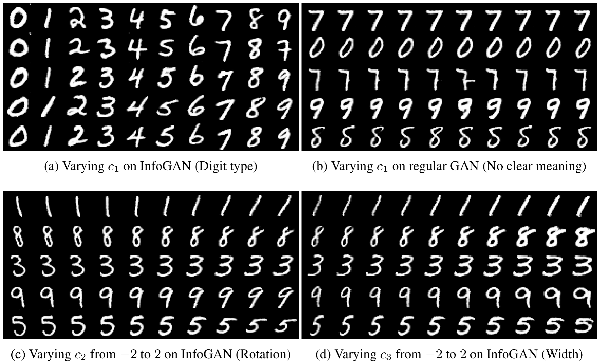

InfoGAN: Interpretable Representation Learning by Information Maximizing Generative Adversarial Nets
=====================================

| **Authors:** Xi Chen, Yan Duan, Rein Houthooft, John Schulman, Ilya Sutskever, Pieter Abbeel
| **Affiliations:** OpenAI

This paper describes InfoGAN, an information-theoretic extension to the GAN that is able to learn disentangled representations in a completely unsupervised manner. InfoGAN maximizes the mutual information between a small subset of the latent variables and the observations.

Mutual Information for Inducing Latent Codes
-------------------------------------

The minimax game defined by GAN is given by

.. math::

   \min_G \max_D V(D, G) = \mathbb{E}_{x \sim P_\text{data}} [\log D(x)] + \mathbb{E}_{z \sim \text{noise}}[\log (1 - D(G(z)))]

This GAN formulation imposes no restrictions on the manner in which the generator may use this noise :math:`z`, which may lead to a highly entangled representation.

The authors propose to decompose the input noise vector into two parts: (i) :math:`z`, which is treated as source of incompressible noise; (ii) :math:`c`, which we will call the latent code and will target the salient structured semantic features of the data distribution.

Now the form of the generator becomes :math:`G(z, c)`. However, standard GAN may ignore the additional latent code :math:`c` by finding a solution satisfying :math:`P_G(x \mid c) = P_G(x)`. To cope with this problem of trivial codes, the authors propose an information-theoretic regularization: there should be high mutual information between latent codes :math:`c` and generator distribution :math:`G(z, c)`.

Given any :math:`x \sim P_G(x)`, we want :math:`P_G(c \mid x)` to have a small entropy. The information in the latent code :math:`c` should not be lost in the generation process. The authors propose to solve the following information-regularized minimax game:

.. math::

   \min_G \max_D V_I(D, G) = V(D, G) - \lambda I(c; G(z, c))

.. note::

   **Mutual Information**

   In information theory, mutual information between two random variables :math:`X` and :math:`Y`, :math:`I(X, Y)`, measure the "amount of information" learned from knowledge of :math:`Y` about :math:`X`. The mutal information can be expressed as the difference between two entropy terms:

   .. math::

      I(X; Y) = H(X) - H(X \mid Y) = H(Y) - H(Y \mid X)

   This definition has an intuitive interpretation: :math:`I(X; Y)` is the reduction of uncertainty in :math:`X` when :math:`Y` is observed.

Variational Mutual Information Maximization
-------------------------------------

The mutual information term :math:`I(c; G(z, c))` is hard to maximize directly as it requires access to the posterior :math:`P(c \mid x)`. The authors define an auxiliary distribution :math:`Q(c \mid x)` to approximate :math:`P(c \mid x)` and obtain a lower bound of :math:`I(c; G(z, c))`:

.. math::

   I(c; G(z, c)) & = H(c) - H(c \mid G(z, c)) \\
   & = \mathbb{E}_{x \sim G(z, c)}[\mathbb{E}_{c' \sim P(c \mid x)}[\log P(c' \mid x)]] + H(c) \\
   & = \mathbb{E}_{x \sim G(z, c)}[D_{KL}(P(\cdot \mid x) \mid\mid Q(\cdot \mid x)) + \mathbb{E}_{c' \sim P(c \mid x)}[\log Q(c' \mid x)]] + H(c) \\
   & \geq \mathbb{E}_{x \sim G(z, c)}[\mathbb{E}_{c' \sim P(c \mid x)}[\log Q(c' \mid x)]] + H(c)

This technique of lower bounding mutual information is known as **Variational Information Maximization**.

**Lemma 5.1.** For random variables :math:`X`, :math:`Y` and function :math:`f(x, y)` under suitable regularity conditions:

.. math::

   \mathbb{E}_{x \sim X, y \sim Y \mid x} [f(x, y)] = \mathbb{E}_{x \sim X, y \sim Y \mid x, x' \sim X \mid x}[f(x', y)]

With Lemma 5.1, we can define a variational lower bound :math:`L_I(G, Q)` of the mutual information:

.. math::

   L_I(G, Q) & = \mathbb{E}_{c \sim P(c), x \sim G(z, c)}[\log Q(c \mid x)] + H(c) \\
   & = \mathbb{E}_{x \sim G(z, c)}[\mathbb{E}_{c' \sim P(c \mid x)}[\log Q(c' \mid x)]] + H(c) \\
   & \leq I(c; G(z, c))

The authors note that :math:`L_I(G, Q)` is easy to approximate with Monte Carlo simulation. In particular, :math:`L_I` can be maximized w.r.t. :math:`Q` directly and w.r.t. :math:`G` via the reparameterization trick.

Hence, InfoGAN is defined as the following minimax game:

.. math::

   \min_{G, Q}\max_D V_\text{InfoGAN}(D, G, Q) = V(D, G) - \lambda L_I(G, Q)

Implementation
-------------------------------------

In practice, the authors parameterize the auxiliary distribution :math:`Q` as a nueral network. :math:`Q` and :math:`D` share all convolutional layers and there is one final fully connected layer to output parameters for the conditional distribution :math:`Q(c \mid x)`.

For categorical latent code :math:`c_i`, a softmax nonlinearity is used to represent :math:`Q(c_i \mid x)`. For continuous latent code :math:`c_i`, treating :math:`Q(c_i \mid x)` as a factored Gaussian is sufficient.

Experiments
-------------------------------------

