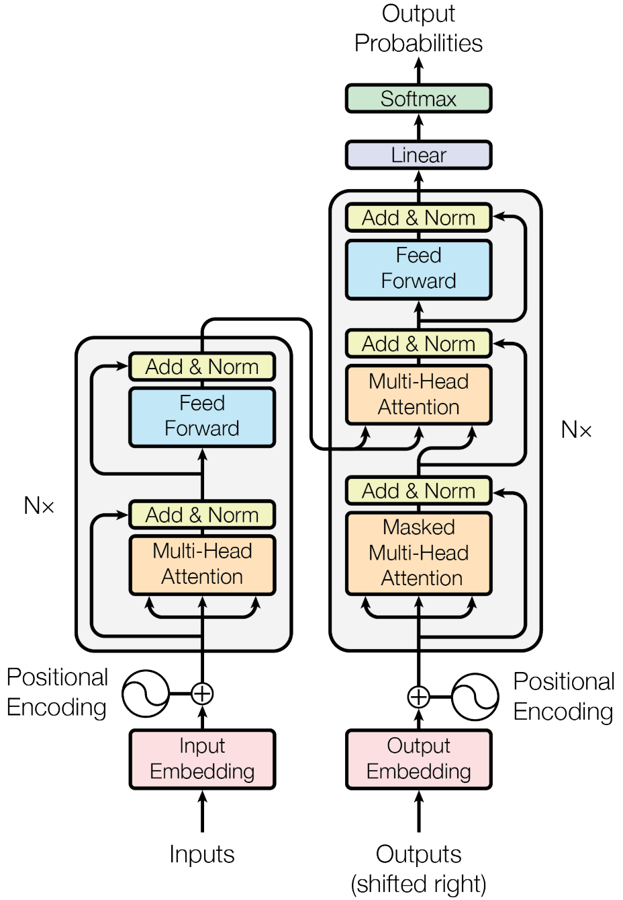
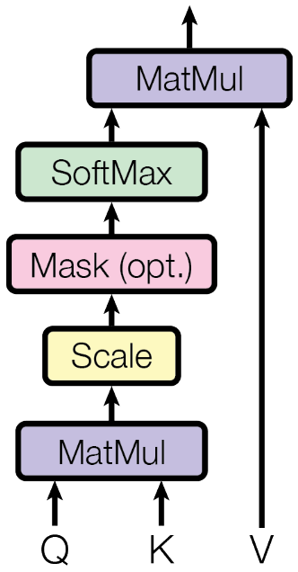
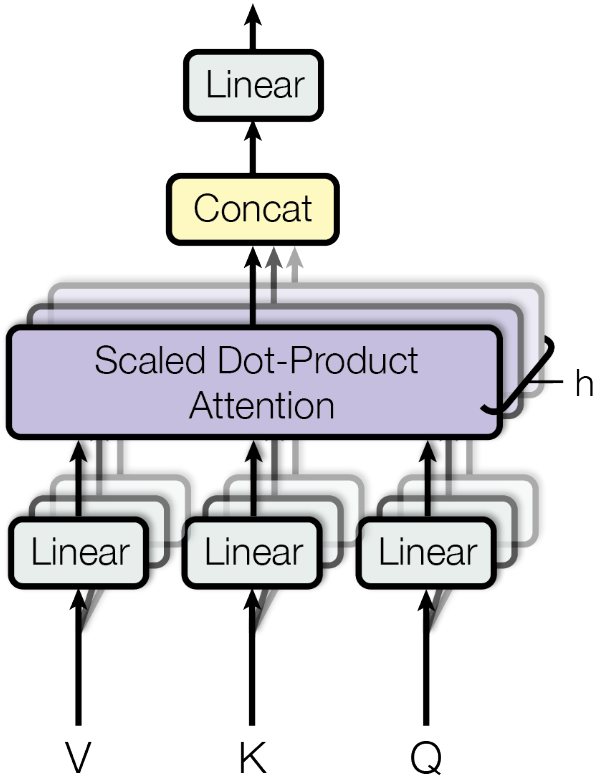

Attention is All You Need
======================================

| **Year:** Jun 2017
| **Authors:** Ashish Vaswani, Noam Shazeer, Niki Parmar, Jakob Uszkoreit, Llion Jones, Aidan N. Gomez, Lukasz Kaiser, Illia Polosukhin
| **Affiliations:** Google Brain, Google Research, University of Toronto

In this work, the authors propose the Transformer, a model architecture based solely on an attention mechanism to draw global dependencies between input and output, dispensing with recurrence and convolutions entirely.

Experiments on two machine translation tasks show these models to be superior in quality while being more parallelizable and requiring significantly less time to train.

Model architecture
--------------------------------------

Most competitive neural sequence transduction models have an encoder-decoder structure. The encoder maps an input sequence of symbol representations :math:`(x_1, \dots, x_n)` to a sequence of continuous representations :math:`\mathbf{z} = (z_1, \dots, z_n)`. Given :math:`\mathbf{z}`, the decoder then generates an output sequence :math:`(y_1, \dots, y_m)` of symbols one element at a time. At each step the model is auto-regressive[1], consuming the previously generated symbols as additional input when generating the next.

The transformer follows the overall architecture using stacked self-attention and point-wise, fully-connected layers for both the encoder and decoder.

Encoder and Decoder Stacks
^^^^^^^^^^^^^^^^^^^^^^^^^^^^^^^^^^^^^^

**Encoder.** The encoder is composed of a stack of :math:`N = 6` idential layers. Each layer has two sub-layers, a multi-head self-attention mechanism and a position-wise fully connected feed-forward network. A residual connection is employed around each of the two sub-layers, followed by layer normalization.

**Decoder.** The decoder has a similar structure to the encoder. In addition to the two sub-layers in each encoder layer, the decoder inserts a third sub-layer, which performs multi-head attention over the output of the encoder stack. A mask is also added to prevent positions from attending to subsequent positions.

Attention
^^^^^^^^^^^^^^^^^^^^^^^^^^^^^^^^^^^^^^

An attention function can be described as mapping a query and a set of key-value pairs to an output.

**Scaled dot-product attention.** The input consists of queries and keys of dimension :math:`d_k` and values of dimension :math:`d_v`. By stacking the vectors into matrices, the attention is given by:

.. math::

   \text{Attention}(Q, K, V) = \text{Softmax}\left( \frac{QK^\top}{\sqrt{d_k}} \right} V

For larger values of :math:`d_k`, the dot products may grow large in magnitude, pushing the softmax function into regions where it has extermely small gradients. The authors scale the dot products by :math:`\frac{1}{\sqrt{d_k}}`.

**Multi-Head Attention.** The authors find it beneficial to linearly project the queries, keys, and values :math:`h` times with different learned linear projections to :math:`d_k`, :math:`d_k`, and :math:`d_v` dimensions. On each of the projected versions, they then apply the attention function in parallel, yielding :math:`d_v`-dimensional output values.

.. math::

   \text{MultiHead}(Q, K, V) & = \text{Concat}(\text{head}_1, \dots, \text{head}_h)W^O \\
   \text{head}_i = \text{Attention}(QW_i^Q, KW_i^K, VW_i^V)

where the projections are parameter matrices :math:`W_i^Q \in \mathbb{R}^{d_{model} \times d_k}`, :math:`W_i^K \in \mathbb{R}^{d_{model} \times d_k}`, :math:`W_i^V \in \mathbb{R}^{d_{model} \times d_v}`.

Multi-head attention allows the model to jointly attend to information from different representation subspaces at different positions.

Position-Wise Feed-Forward Networks
^^^^^^^^^^^^^^^^^^^^^^^^^^^^^^^^^^^^^^

Each of the layers in the encoder-decoder contains a fully connected feed-forward network. This consists of two linear transformations with a ReLU activation in between:

.. math::

   \text{FFN}(x) = \max(0, xW_1 + b_1)W_2 + b_2

Positional Encoding
^^^^^^^^^^^^^^^^^^^^^^^^^^^^^^^^^^^^^^

In order for the model to make use of the order of the sequence, we must inject some information about the relative or absolute position of tokens in the sequence. In this work, the authors use sine and cosine functions of different frequencies:

.. math::

   \text{PE}_{(pos, 2i)} & = \sin(pos / 10000^{2i/d_{model}}) \\
   \text{PE}_{(pos, 2i+1)} & = \cos(pos / 10000^{2i/d_{model}}) \\

References
--------------------------------------

**[1]** Graves, A. (2013). Generating sequences with recurrent neural networks. *arXiv preprint arXiv*:1308.0850.
