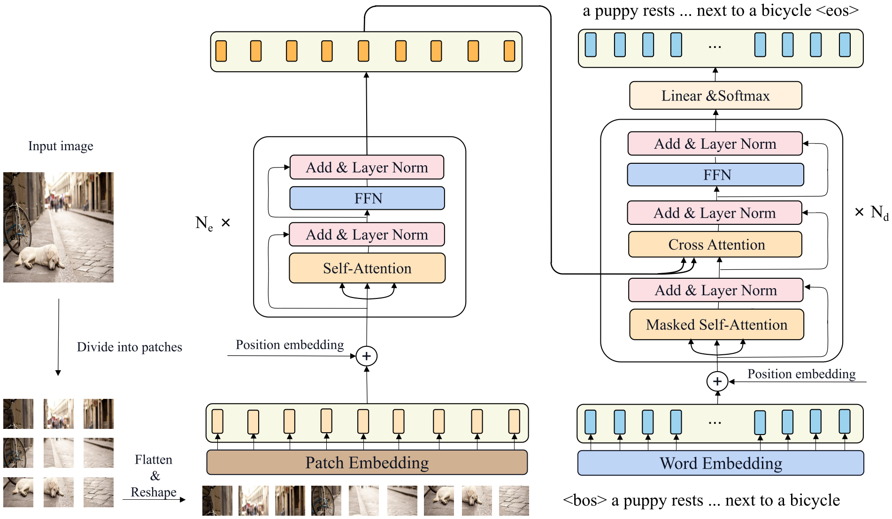
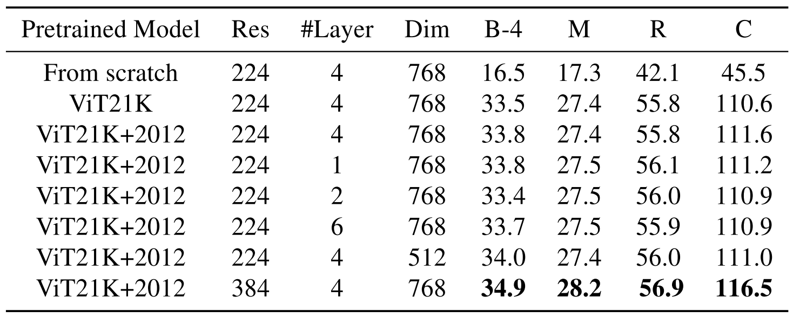

CPTR: Full Transformer Network for Image Captioning
=====================================

| **Authors**: Wei Liu, Sihan Chen, Longteng Guo, Xinxin Zhu, Jing Liu
| **Affiliations**: Chinese Academy of Sciences, University of Chinese Academy of Sciences

In this paper, the authors consider the image captioning task from a new sequence-to-sequence prediction perspective and propose **CaPtion TransformeR** (CPTR). Compared to the "CNN + Transformer" design paradigm, CPTR can model global context at every encoder layer from the beginnning and is totally convolution-free.

Extensive experiments demonstrate the effectiveness of the proposed model and CPTR surpass the conventional "CNN + Transformer" methods on the MSCOCO dataset.

Framework
-------------------------------------

Instead of using a pretrained CNN or Faster R-CNN model to extract spatial features or bottom-up features, the authors sequentialize the input image and treat image cpationing as a sequence-to-sequence prediction task.

The input image is first reshaped into a fixed resolution :math:`X \in \mathbb{R}^{H \times W \times 3}`, and then divided into :math:`N` patches, where :math:`N = \frac{H}{P} \times \frac{W}{P}`. After that the authors flatten each patch and reshape them into a 1D patch sequence :math:`X_p \in \mathbb{R}^{N \times (P^2 \cdot 3)}`. A linear embedding layer is then used to map the flattened patch sequence to laten space and a learnable 1D position embedding is added to the patch features.

The encoder of CPTR consists of :math:`N_e` stacked identical layers, each of which consists a multi-head self-attention (MHA) with :math:`H` heads followed by a positional feed-forward network.

The decoder of CPTR uses sinusoid positional embedding to the word embedding features and includes :math:`N_d` stacked identical layers which consists of a masked multi-head self-attention layer followed by a multi-head cross attention and a positional feed-forward sublayer.

Experiments
-------------------------------------

CPTR is trained in an end-to-end fasion with the encoder initialized by the pre-trained ViT model.

- input image resolution: :math:`384 \times 384`
- path size: :math:`16 \times 16`
- feature dimension: :math:`768`
- attention head number: :math:`12`
- encoder layers: :math:`12`
- decoder layers: :math:`4`

Ablation Study
-------------------------------------

