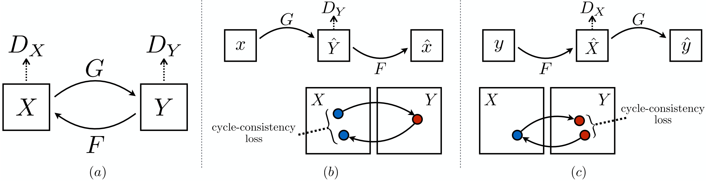
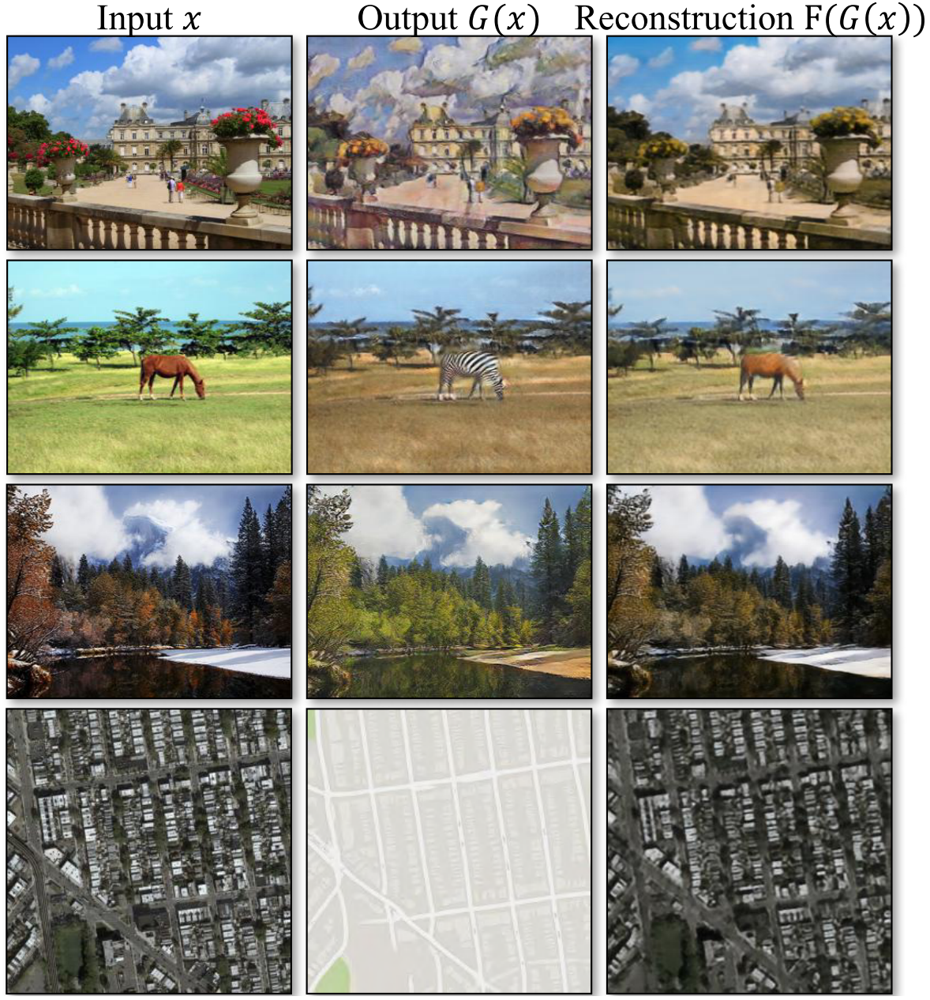
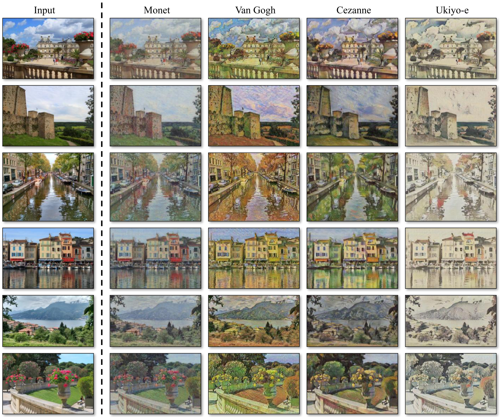
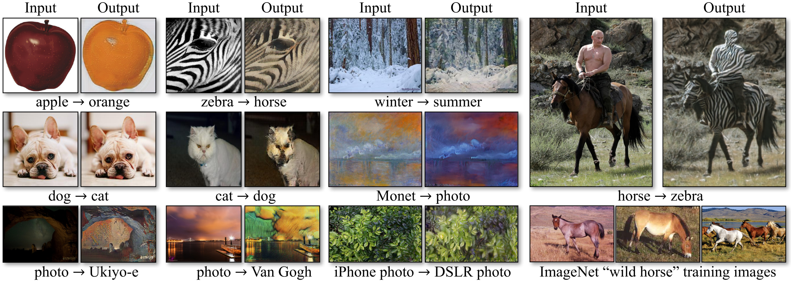

Unpaired Image-to-Image Translation Using Cycle-Consistent Adversarial Networks
=====================================

| **Year:** Mar 2017
| **Authors:** Jun-Yan Zhu, Taesung Park, Phillip Isola, Alexei A. Efros
| **Affiliations:** Berkeley AI Research Laboratory

In this work, the authors present an approach for learning to translate an image from a source domain :math:`X` to a target domain :math:`Y` in the absence of paired examples :math:`\{x_i, y_i\}_{i=1}^N`.

They train a mapping :math:`G: X \to Y` such that the output :math:`\hat{y} = G(x)`, :math:`x \in X` is indistinguishable from images :math:`y \in Y`. However, such a translation does not guarantee that an individual input :math:`x` and output :math:`y` are paired up in a meaningful way. Moreover, standard procedures often lead to the problem of **mode collapse**.

Therefore, they exploit the property that the translation should be "cycle consistent". If we have a translator :math:`G: X \to Y` and another translator :math:`F: Y \to X`, then :math:`G` and :math:`F` should be inverses of each other and both mappings should be bijections. They apply this structural assumption by training :math:`G` and :math:`F` simultaneously and adding a **cycle consistency loss** that encourages :math:`F(G(x)) \approx x` and :math:`G(F(y)) \approx y`.

Adversarial Loss
-------------------------------------

For the mapping function :math:`G: X \to Y` and its discriminator :math:`D_Y`, the objective is expressed as:

.. math::

   \mathcal{L}_\text{GAN}(G, D_Y, X, Y) = \mathbb{E}_{y \sim p_\text{data}(y)}[\log D_Y(y)] + \mathbb{E}_{x \sim p_\text{data}(x)}[\log (1 - D_Y(G(x)))]

A similar adversarial loss is applied for the mapping function :math:`F: Y \to X`.

Cycle Consistency Loss
-------------------------------------

Adversarial losses alone cannot guarantee that the learned function can map an individual input :math:`x_i` to a desired output :math:`y_i`. To further reduce the space of possible mapping functions, the authors argue that the learned mapping functions should be cycle-consistent: for each image :math:`x` from domain :math:`X`, the image translation cycle should be able to bring :math:`x` back to the original image, i.e., :math:`x \to G(x) \to F(G(x)) \approx x`. This is called **forward cycle consistency**, and we have **backward cycle consistency**: :math:`y \to F(y) \to G(F(y)) \approx y`. The **cycle consistency loss** is given by

.. math::

   \mathcal{L}_\text{cyc}(G, F) = \mathbb{E}_{x \sim p_\text{data}(x)} [\lVert F(G(x)) - x\rVert_1] + \mathbb{E}_{y \sim p_\text{data}(y)}[\lVert G(F(y)) - y\rVert_1]

The full objective is then:

.. math::

   \mathcal{L}(G, F, D_X, D_Y) = \mathcal{L}_\text{GAN}(G, D_Y, X, Y) + \mathcal{L}_\text{GAN}(F, D_Y, Y, X) + \lambda \mathcal{L}_\text{cyc}(G, F)

Experiment Results
-------------------------------------

During training, the authors follow the strategy in ** and update the discriminator using a history of generated images rather than the ones produced by the latest generators.

Thoughts
-------------------------------------

This architecture is tailored for good performance on the appearance changes, with little success on geometric changes.
