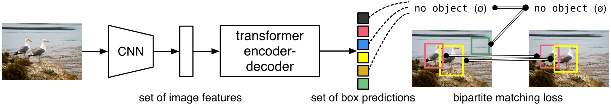
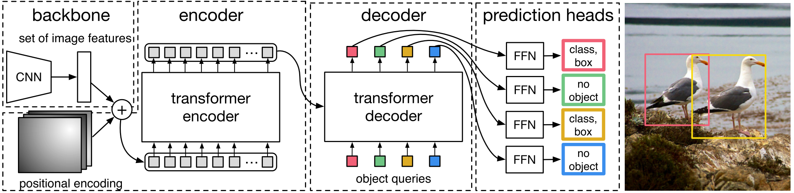

End-to-End Object Detection with Transformers (DETR)
=====================================

| **Authors:** Nicolas Carion, Francisco Massa, Gabriel Synnaeve, Nicolas Usunier, Alexander Kirillov, Sergey Zagoruyko
| **Affiliations:** Facebook AI

The goal of object detection is predict a set of bounding boxes and category labels for each object of interest. Modern detectors address this set prediction task by defining surrogate regression and classification problems on a large set of proposals, anchors, or window centers.

The authors present a new method that views object detection as a direct set prediction problem. The main ingredients of the new framework, DETR, are a set-based global loss that forces unique predictions via bipartite matching, and a transformer encoder-decoder architecture. Given a fixed small set of learned object queries, DETR reasons about the relations of the objects and the global image context to directly output the final set of predictions in parallel.

Experiments show that DETR outperforms competitive baselines on the COCO object detection dataset. Also, DETR can be easily generalized to produce panoptic segmentation in a unified manner.

The DETR Model
-------------------------------------

Two ingredients are essential for direct set predictions in detection:
  1. a set prediction loss that forces unique matching between predicted and ground truth boxes
  2. an architecture that predicts a set of objects in a single pass

Object Detection Set Prediction Loss
-------------------------------------

DETR infers a fixed-size set of :math:`N` predictions in a single pass through the decoder. To score predicted objects with respect to the ground truth, the authors propose a loss that produces an optimal bipartite matching between predicted and ground truth objects, and then optimize object-specific bounding box losses.

Let :math:`y = \{y_i\}_{i=1}^N` be the ground truth set of objects padded with :math:`\varnothing`, and :math:`\hat{y} = \{\hat{y}_i\}_{i=1}^N` be the set of :math:`N` predictions. To find a bipartite matching between these two sets we search for a permutation of :math:`N` elements :math:`\sigma \in \mathcal{\Sigma}_N` with the lowest cost:

.. math::

   \hat{\sigma} = \text{argmin}_{\sigma \in \mathcal{\sigma}_N} \sum_i^N \mathcal{L}_\text{match}(y_i, \hat{y}_{\sigma(i)})

where :math:`\mathcal{L}_\text{match}` is a pair-wise matching cost. The optimal assignment is computed efficiently with the Hungarian algorithm.
