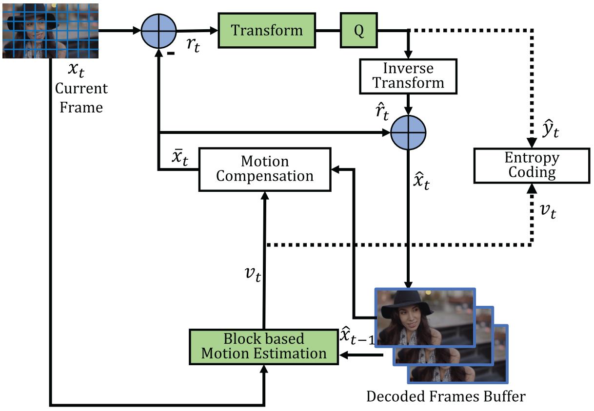
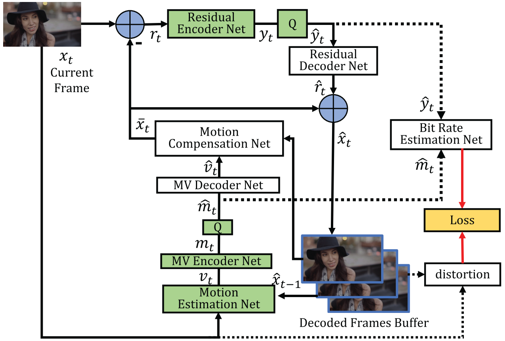
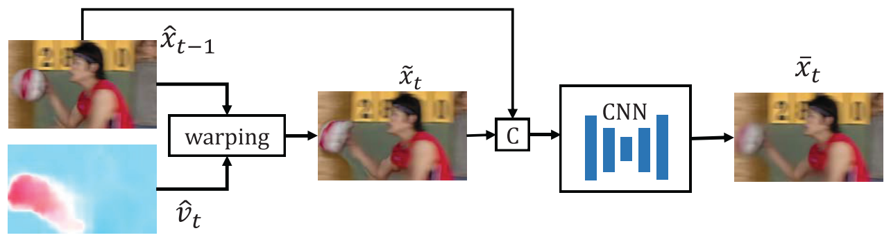
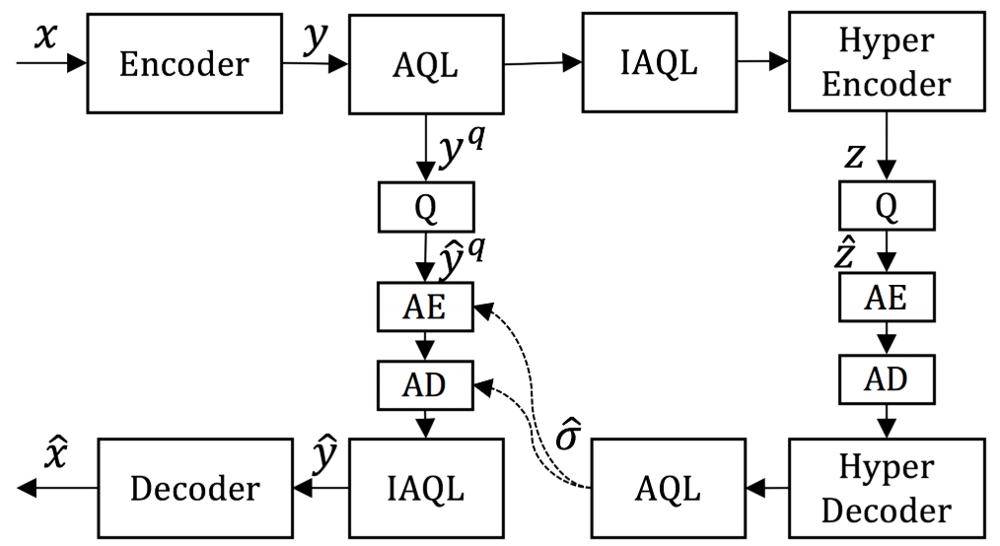

An End-to-End Learning Framework for Video Compression
=====================================

| **Year:** Apr 2020
| **Authors:** Guo Lu, Xiaoyun Zhang, Wanli Ouyang, Li Chen, Zhiyong Gao, Dong Xu
| **Links:** `IEEE Xplore <https://ieeexplore.ieee.org/document/9072487>`_

Existing methods try to employ DNN for video compression [1]. However, most work only replace one or two modules in the traditional framework instead of optimizing the video compression system in an end-to-end fashion.

There are two challenges for building an end-to-end optimized video compression system:
    - it is very difficult to build a learning based video compression system because of the complicated coding procedure
    - it is necessary to design a scheme to generate and compress the motion information that is tailored for video compression

Inspired by the previous work [2], the authors propose the first end-to-end deep video compression (DVC) framework. All components in video compression are implemented with the end-to-end neural networks, and are jointly optimized based on the rate-distortion trade-off through a single loss function. The framework is also very flexible and two variants, :code:`DVC_Lite` and :code:`DVC_Pro`, are proposed for speed/efficiency priority. The adaptive quantization layer for the DVC framework significantly reduces the number of parameters for variable bitrate coding.

Expreimental results show that the proposed approach can outperform the widely used video coding standard H.264 and be even on par with the latest standard H.265.

Notations
-------------------------------------

- :math:`\mathcal{V} = \{x_1, \dots, x_{t-1}, x_t, \dots \}`: current video sequences
- :math:`\bar{x}_t`: predicted frame
- :math:`\hat{x}_t`: reconstructed frame
- :math:`r_t` (transformed to :math:`y_t`): residual (error) between the original frame :math:`x_t` and the predicted frame :math:`\bar{x}_t`
- :math:`\hat{r}_t`: residual (error) between the original frame :math:`x_t` and the reconstructed/decoded frame :math:`\hat{x}_t`
- :math:`v_t` (transformed to :math:`m_t`): motion vector or optical flow value
- :math:`\hat{v}_t`: reconstructed version

Hybrid Coding Framework of Video Compression
-------------------------------------

The input frame :math:`x_t` is split into a set of blocks. The traditional video compression algorithm is summarized as follows,
    1. Block based motion estimation.
    2. Motion compensation.
    3. Transform and quantization.
    4. Inverse transform.
    5. Entropy coding.
    6. Frame reconstruction.

Refer to [3, 4] for more details.

The Proposed End-to-End Deep Video Compression Framework
-------------------------------------

Motion, residual and entropy bits for hybrid coding are all learned by networks in the proposed framework. All these functional modules are jointly optimized in an end-to-end way using a single rate-distortion loss. The differences between the proposed method and traditional video compression codecs are summarized below.

**Step 1. Motion estimation and compression.** The authors use a CNN model to estimate the optical flow [5], which is considered as the motion information :math:`v_t`. An auto-encoder network with quantization is used to compress the optical flow in a lossy way.

**Step 2. Motion compensation.** A pixel-wise motion compensation approach is implemented using a neural network.

**Step 3-4. Transform, quantization and inverse transform.** The linear transform is replaced by a highly non-linear residual encoder-decoder network.

**Step 5. Entropy coding.** At the training stage, a bit rate estimation net is used to obtain probability distribution of each symbol.

**Step 6. Frame reconstruction.** Reconstructed frame :math:`\hat{x}_t` is generated based on predicted frame :math:`\bar{x}_t` and the reconstructed residual :math:`\hat{r}_t`.

Motion Estimation Net
-------------------------------------

The authors use the learning based optical flow method Spynet to estimate motion information. Spynet is jointly optimized with the whole compression system by minimizing the rate-distorition trade-off.

MV Encoder and Decoder Net
-------------------------------------

To compress pixel-level optical flow :math:`v_t` from motion estimation network, the authors utilize an auto-encoder style network, as proposed in [6].

Motion Compensation Net
-------------------------------------

Given the previous reconstructed frame :math:`\hat{x}_{t-1}` and the motion vector :math:`\hat{v}_t`, the motion compensation network obtains the predicted frame :math:`\bar{x}_t`.

The previous frame :math:`\hat{x}_{t-1}` is first warped to the current frame based on the motion information :math:`\hat{v}_t`:

.. math::

   \tilde{x}_t = \mathcal{W}(\hat{x}_{t-1}, \hat{v}_t)

where :math:`\mathcal{W}` is the backward warp operation [7]. Then they concatenate :math:`\tilde{x}` and the reference frame :math:`\hat{x}_{t-1}`, and feed them into another CNN to obtain the refined predicted frame :math:`\bar{x}_t`.

Residual Encoder and Decoder Net
-------------------------------------

After motion estimation and motion compensation, we obtain the predicted frame :math:`\bar{x}_t` and the residual information :math:`r_t`. A variational image compression framework [8] is used to compress the residual.

Bit Rate Estimation Net
-------------------------------------

To optimize the whole network by considering the rate-distortion trade-off, the authors use the CNN model in [8] to estimate the probability distributions of :math:`\hat{y}_t` and :math:`\hat{m}_t`.

Loss Function
-------------------------------------

The authors propose the following rate-distortion optimization problem:

.. math::

   \mathcal{L} = \lambda D + R = \lambda d(x_t, \hat{x}_t) + [H(\hat{m}_t) + H(\hat{y}_t)]

where :math:`d(x_t, \hat{x}_t)` can be measured by MSE or MS-MSSIM. To stablize the training procedure, the authors also introduce an auxiliary loss, formulated as:

.. math::

   \mathcal{L}_0 = \lambda D + R = \lambda [d(x_t, \hat{x}_t) + \beta d(x_t, \tilde{x}_t)] + [H(\hat{m}_t) + H(\hat{y}_t)]

:math:`\beta` is the weight parameter and set to 0.1.

Quantization
-------------------------------------

Quantization operation is not differential, which makes end-to-end training impossible. Inspired by [6], the authors replace the quantization operation by adding uniform noise in the training stage.

Decoded Frame Buffer
-------------------------------------

The encoding procedure forms a chain of dependency. To simplify the training procedure, the authors adopt an online updating strategy. They use a buffer to store the previous frame and update each training sample in an epoch.

Flexible Extensions for the DVC Model
-------------------------------------

* :code:`DVC_Lite`
* :code:`DVC_Pro`

Adaptive Quantization Layer
-------------------------------------

In order to reduce the number of models for video coding at multiple bitrates, the authors introduce the **adaptive quantization layer** (AQL). In the proposed video compression scheme, they first train a DVC model at high-bitrate without using the AQL. To obtain other models at low-bitrates, they integrate the AQL to the pre-trained baseline DVC model. Finally, they only fine-tune the AQL for other models at different bitrates.

Reference
-------------------------------------

**[1]** Liu, D., Li, Y., Lin, J., Li, H., & Wu, F. (2020). Deep learning-based video coding: A review and a case study. ACM Computing Surveys (CSUR), 53(1), 1-35.

**[2]** Lu, G., Ouyang, W., Xu, D., Zhang, X., Cai, C., & Gao, Z. (2019). Dvc: An end-to-end deep video compression framework. In Proceedings of the IEEE Conference on Computer Vision and Pattern Recognition (pp. 11006-11015).

**[3]** Wiegand, T., Sullivan, G. J., Bjontegaard, G., & Luthra, A. (2003). Overview of the H. 264/AVC video coding standard. IEEE Transactions on circuits and systems for video technology, 13(7), 560-576.

**[4]** Sullivan, G. J., Ohm, J. R., Han, W. J., & Wiegand, T. (2012). Overview of the high efficiency video coding (HEVC) standard. IEEE Transactions on circuits and systems for video technology, 22(12), 1649-1668.

**[5]** Ranjan, A., & Black, M. J. (2017). Optical flow estimation using a spatial pyramid network. In Proceedings of the IEEE Conference on Computer Vision and Pattern Recognition (pp. 4161-4170).

**[6]** Ballé, J., Laparra, V., & Simoncelli, E. P. (2016). End-to-end optimized image compression. arXiv preprint arXiv:1611.01704.

**[7]** Jaderberg, M., Simonyan, K., & Zisserman, A. (2015). Spatial transformer networks. Advances in neural information processing systems, 28, 2017-2025.

**[8]** Ballé, J., Minnen, D., Singh, S., Hwang, S. J., & Johnston, N. (2018). Variational image compression with a scale hyperprior. arXiv preprint arXiv:1802.01436.
