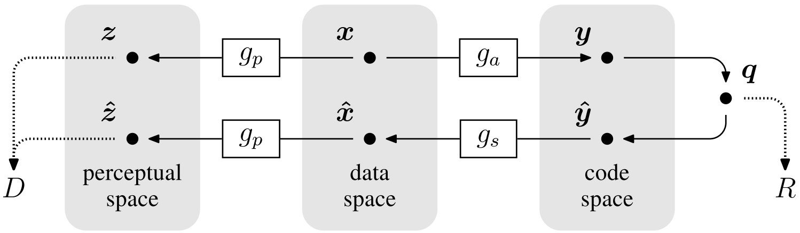

End-To-End Optimized Image Compression
=====================================

| **Authors:** Johannes Balle, Valero Laparra, Eero P. Simoncelli
| **Affiliations:** New York University, Universitat de Valencia

The authors propose an image compression method, consisting of a nonlinear analysis transformation, a uniform quantizer, and a nonlinear synthesis transformation. Using a variant of SGD, they jointly optimize the entire model for rate-distortion performance over a dataset of training images.

Experiment results show that the proposed method generally exhibits better rate-distortion performance than the standard JPEG and JPEG 2000. The authors observe improvement in visual quality measured by MS-SSIM for all images at all bit rates.

----

For **lossy compression problem**, one must trade off two competing costs: the entropy of the discretized representation (**rate**) and the error arising from the quantization (**distortion**). Joint optimization of rate and distortion is difficult.

.. note::

   **Transform Coding**

   Most existing image compression methods operate by linearly transforming the data vector into a suitable continuous-valued representation, quantizing its elements independently, and then encoding the resulting discrete representation using a lossless **entropy code**. This scheme is called **transform coding** due to the central role of the transformation. Typically, the three components of transform coding methods - transform, quantizer, and entropy code - are separately optimized.

The authors propose a framework for end-to-end optimization of an image compression model based on nonlinear transforms. Specifically, a generalized divisive normalization (GDN) joint nonlinearity is used, followed by uniform scalar quantization. The compressed image is reconstructed from the quantized values using an approximate parametric nonlinear inverse transform. For any desired point along the rate-distortion curve, the parameters of both analysis and synthesis transofrms are jointly optimized using SGD.

Choice of Forward, Inverse, and Perceptual Transforms
-------------------------------------

The analysis transform :math:`g_\alpha` consists of three stages of convolution, subsampling, and divisive normalization. Each stage begins with an affine convolution followed by downsampling, and each stage concludes with a GDN operation.

Analogously, the synthesis transform :math:`g_s` consists of three stages, with the order of operations reversed within each stage, downsampling replaced by upsampling, and GDN replaced by an approximate inverse called IGDN.

Optimization of Nonlinear Transform Coding Level
-------------------------------------

The objective is to minimize a weighted sum of the rate and distortion, :math:`R + \lambda D`, over the parameters of the analysis and synthesis transforms and the entropy code.

Rather than attempting optimal quantization directly in the image space, which is intractable due to the high dimensionality, they instead assume a fixed uniform scalar quantizer in the code space, and aim to have the nonlinear transformations warp the space in an appropriate way. Thus they define the objective functional directly in terms of entropy:

.. math::

   L[g_a, g_s, P_q] = - \mathbb{E}[\log_2 P_q] + \lambda \mathbb{E}[d(z, \hat{z}]

