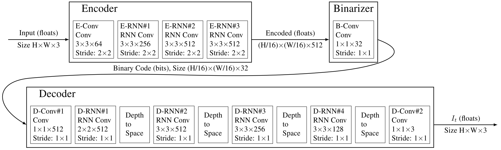

Full Resolution Image Compression with Recurrent Neural Networks
=====================================

| **Authors:** George Toderici, Damien Vincent, Nick Johnston, Sung Jin Hwang, David Minnen, Joel Shor, Michele Covell
| **Affiliations:** Google Research

Previous work [1] achieved better than SOTA compression rates for a given qualtiy, and was limited to :math:`32 \times 32` images. THe authors' goal is to provide a neural network which is competitive across compression rates on images of arbitrary size. There are two possible ways to achieve this:
  1. design a stronger patch-based residual encoder
  2. design an entropy coder that is able to capture long-term dependencies between patches in the image
The authors address both problems and present a set of full-resolution lossy image compression methods based on RNNs.

For evaluation purposes, the authors two human visual system-inspired metrics, PSNR-HVS and MS-SSIM.

Experiment results show improvements of 4.3% to 8.8% AUC on the Kodak dataset and the proposed model is the first neural network architecture that outperforms JPEG on the rate-distortion curve.

Method
-------------------------------------

The proposed compression networks are comprised of an encoding network :math:`E`, a binarizer :math:`B` and a decoding network :math:`D`, where :math:`D` and :math:`E` containt recurrent network components. The input images are first encoded, and then transformed into binary codes that can be stored or transmitted to the deocder. The decoder creates an estimate of the original input image based on the received binary code.

The figure below shows the architecture of a single iteration. Note that the binarizer :math:`B` is stateless.

The single iteration can represented by:

.. math::

   b_t = B(E_t(r_{t-1})), \;\;\; \hat{x}_t = D_t(b_t) + \gamma \hat{x}_{t-1} \\
   r_t = x - \hat{x}_t, r_0 = x, \hat{x}_0 = 0

where :math:`D_t` and :math:`E_t` represent the decoder and encoder with their states at iteration :math:`t` respectively.

Further Reading
-------------------------------------

**[1]** Variable Rate Image Compression with Recurrent Neural Networks.
