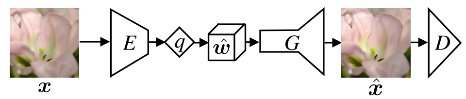
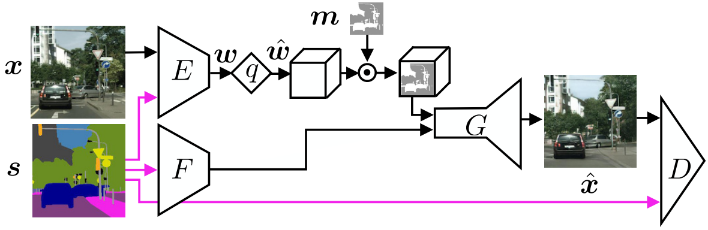
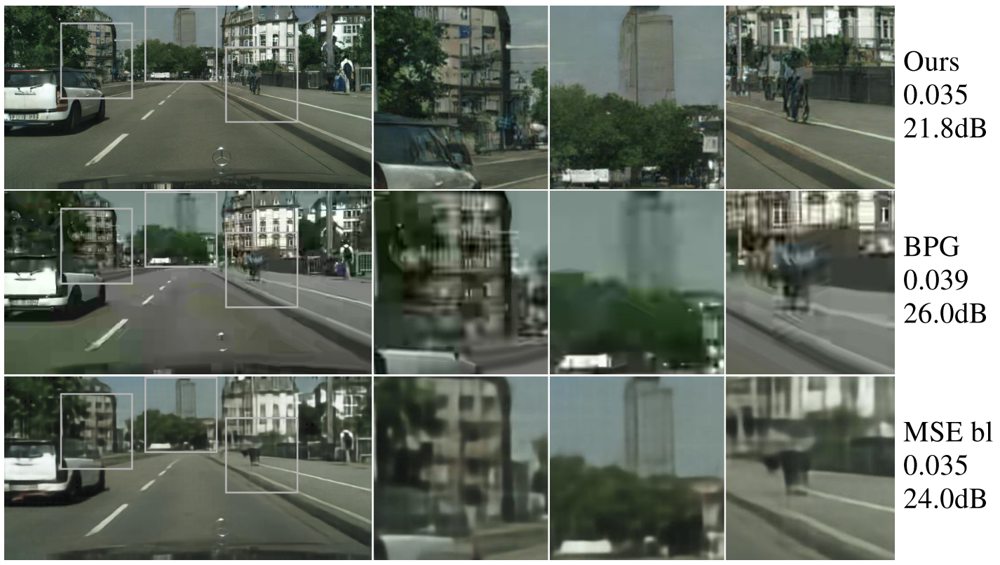
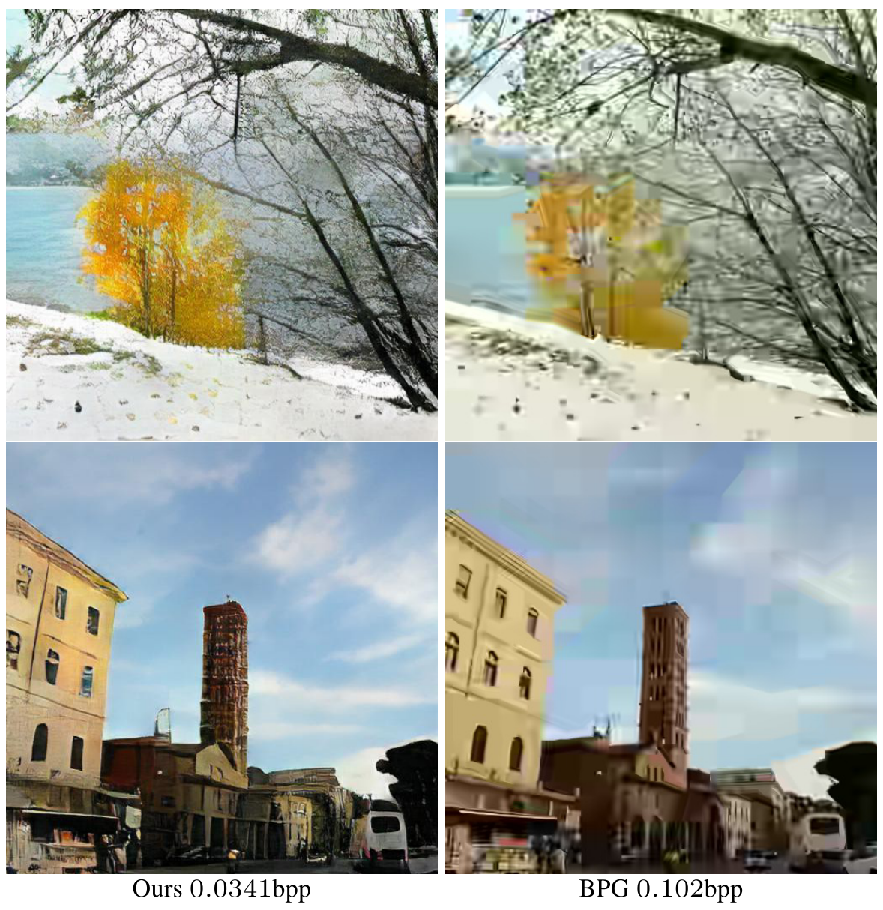
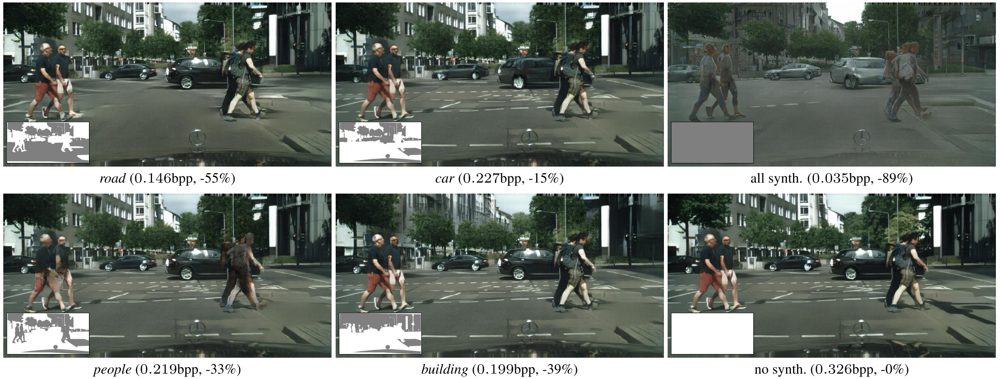

Generative Adversarial Networks for Extreme Learned Image Compression
=====================================

| **Authors:** Eirikur Agustsson, Michael Tschannen, Fabian Mentzer, Radu Timofte, Luc Van Gool
| **Affiliations:** ETH Zurich

Deep compression systems are typically optimized for traditional distortion metrics such as peak signal-to-noise ratio (PSNR) or multi-scale structural similarity (MS-SSIM). For very low bitrates, these distortion metrics lose significance as they favor pixel-wise prreservation of local (high-entropy) structure over preserving texture and global structure. To further advance deep image compression it is therefore of great importance to develop new training objectives , such as adversarial losses.

The authors prpose a principled GAN framework for full-resolution image compression and use it to realize an extreme image compression system, targeting bitrates below 0.1 bpp. The authors consider two modes of operation, namely
  - **generative compression (GC):** preserving the overall image content while generating structure of different scales
  - **selective generative compression (SC):** completely generating parts of the image from a semantic label map

For GC, a comprehensive user study shows that the proposed compression system yields visually considerably more appealing results than BPG and AEDC.

Deep Image Compression
-------------------------------------

To compress an image :math:`\mathbf{x} \in \mathcal{X}`, one learns an encoder :math:`E`, a decoder :math:`G`, and a finite quantizer :math:`q`. The encoder :math:`E` maps the image to a latent feature map :math:`\mathbf{w}`, whose values are then quantized to :math:`L` levels to obtain a representation :math:`\hat{\mathbf{w}} = q(E(\mathbf{x}))`. A differentiable relaxation of :math:`q` can be used to allow backpropagation.

The rate-distortion trade-off between reconstruction quality and bitrate is

.. math::

   \mathbb{E}[d(\mathbf{x}, \hat{\mathbf{x}}] + \beta H(\hat{\mathbf{w}})

Since the entropy is bounded by

.. math::

   H(\hat{\mathbf{w}}) \leq \text{dim}(\hat{\mathbf{w}}) \log_2(L)

It is also valid to set :math:`\beta = 0` and control the maximum bitrate through the bound. While potentially leading to suboptimal bitrates, this avoids to model the entropy explicitly as a loss term.

Generative Compression (GC)
-------------------------------------

The figure below shows an overview of the GC architecture.

With an encoder :math:`E` and quantizer :math:`z`, the image :math:`\mathbf{x}` is encoded to a compressed representation

.. math::

   \hat{\mathbf{w}} = q(E(\mathbf{x}))

Optionally we could concatenate :math:`\hat{\mathbf{w}}` with noise :math:`v` drawn from the a fixed prior :math:`p_v` to form the latent vector :math:`\mathbf{z}`. The decoder/generator :math:`G` then tries to generate an image :math:`\hat{\mathbf{x}} = G(\mathbf{z})`. Using :math:`\mathbf{z} = [\hat{\mathbf{w}}, \mathbf{v}]`, this can be expressed by their saddle-point objective for generative compression:

.. math::

   \min_{E, G} \max_D \; \mathbb{E}[f(D(\mathbf{x}))] + \mathbb{E}[g(D(G(\mathbf{z}))] + \lambda \mathbb{E}[d(\mathbf{x}, G(\mathbf{z}))] + \beta H(\hat{\mathbf{w}})

where :math:`f(y) = (y - 1)^2` and :math:`g(y) = y^2` as proposed in *Least Squares Generative Adversarial Networks*. Since the last two terms do not depend on the discriminator, the discriminator still computes the :math:`f`-divergence :math:`\mathcal{L}_\text{GAN}`:

.. math::

   \min_{E, G} \; \mathcal{L}_\text{GAN} + \lambda \mathbb{E}[d(\mathbf{x}, G(\mathbf{z}))] + \beta H(\hat{\mathbf{w}})

GC can be easily extended to a conditional case, referred to as GC (D+). However, the additional information :math:`s` is fed to the discriminator :math:`D` only.

Selective Generative Compression (SC)
-------------------------------------

In the setting of SC, the network is guided in terms of what should be generated and what should be preserved. The figure belows gives an overview of the network.

To guide the network with semantics, the authors mask the distortion :math:`d`, such that it is only computed over the region to be preserved.

PSNR and MS-SSIM as Quality Measures
-------------------------------------

Common distortion measures, such as PSNR and MS-SSIM cannot measure the "realistic-ness", as they penalize changes in local structure rather than assessing preservation of the global image content. This becomes apparent by comparing reconstructions produced by the GC model with those obtained by the MSE baseline and BPG.

The reconstructions of the GC model look more realistic yet having 4.2 dB larger PSNR than those of BPG.

Experiment Results
-------------------------------------

Conclusion
-------------------------------------

Interesting directions for future work are to develop a mechanism for controlling spatial allocation of bits for GC, and to combine SC with saliency information to determine what regions to preserve.
