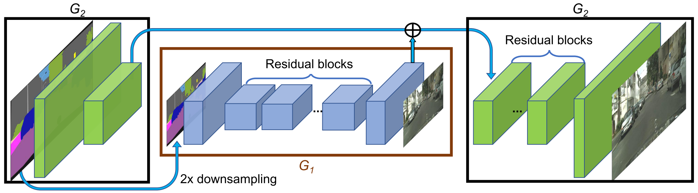
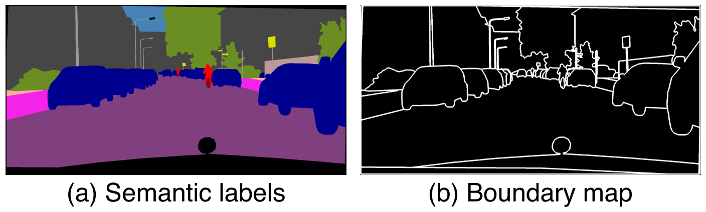
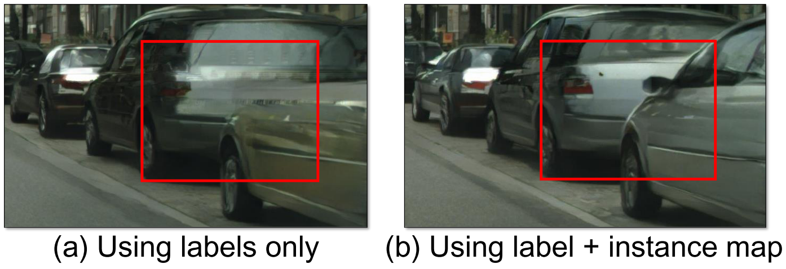
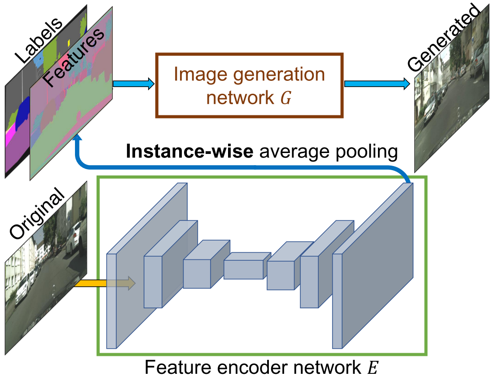
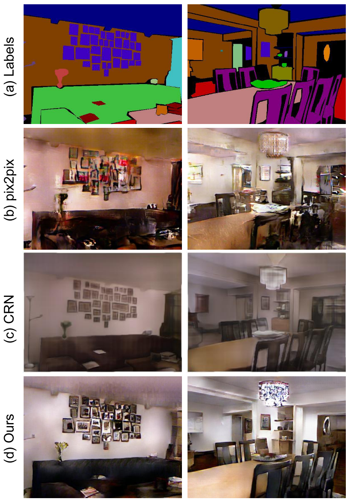

High-Resolution Image Synthesis and Semantic Manipulation with Conditional GANs (Pix2PixHD)
=====================================

| **Authors:** Ting-Chun Wang, Ming-Yu Liu, Jun-Yan Zhu, Andrew Tao, Jan Kautz, Bryan Catanzaro
| **Affiliations:** NVIDIA Corporation, UC Berkeley

In this paper, the authors discuss a new approach that produces high-resolution (2048 x 1024) images from semantic label maps. They address two main issues of previous SOTA methods:

- the difficulty of generating high-resolution images with GANs
- the lack of details and realistic textures

They propose to generate 2048 by 1024 visually appealing results with a novel adversarial loss, as well as new multi-scale generator and discriminator architectures.

They further extend the method in two directions:

- enable flexible object manipulation using instance-level object segmentation information
- generate diverse results given the same input label map

This method outperforms previous approaches regarding quantitative evaluations and human perception studies.

Improving Photorealism and Resolution
-------------------------------------

The authors improve the Pix2Pix framework by using a coarse-to-fine generator, a multi-scale discriminator architecture, and a robust adversarial learning objective function.

**Coarse-to-fine generator:** The authors decompose the generator into two sub-networks: the global generator network :math:`G_1` and the local enhancer :math:`G_2`. The global generator network outputs at a resolution of 1024 x 512, and the local enhancer outputs with a resolution of 2048 x 1024. Additional local enhancer networks could be utilized to synthesize images at an higher resolution.

The global generator is built on the architecture proposed in **[1]**. It consists of 3 components: a convolutional front-end :math:`G_1^{(F)}`, a set of residual blocks :math:`G_1^{(R)}`, and a transposed convolutional back-end :math:`G_1^{(B)}`.

The local enhancer network also consists of 3 components: a convolutional front-end :math:`G_2^{(F)}`, a set of residual blocks :math:`G_2^{(R)}`, and a transposed convolutional back-end :math:`G_2^{(B)}`. The input to :math:`G_2^{(R)}` is the element-wise sum of the :math:`G_2^{(F)}` and :math:`G_1^{(B)}`.

During training, they first train :math:`G_1` on lower resolution images, and then train the two networks jointly on high resolution images.

**Multi-scale discriminators:** The authors use 3 discriminators that have an identical network structure but operate at different image scales, referred to as :math:`D_1`, :math:`D_2`, and :math:`D_3`. **Without the mutli-scale discriminators, the authors observe that many repeated patterns often appear in the generated images.**

**Improved adversarial loss:** The authors improve the GAN loss by incorporating a feature matching loss based on the discriminator. Specifically, they extract features from multiple layers of the discriminator and learn to match these intermediate representations from the real and the synthesized images. The feature matching loss :math:`\mathcal{L}_{FM}(G, D_k)` is calculated as:

.. math::

   \mathcal{L}_{FM}(G, D_k) = \mathbb{E}_{(\mathbf{s}, \mathbf{x})} \frac{1}{N_i} \left[ \left\lVert D_k^{(i)}(\mathbf{s}, \mathbf{x}) - D_k^{(i)}(\mathbf{s}, G(\mathbf{s})) \right\rVert_1 \right]

The full objective combines both GAN loss and feature matching loss as:

.. math::

   \min_G \left( \left( \max_{D_1, D_2, D_3} \sum_{k=1, 2, 3} \mathcal{L}_{GAN}(G, D_k) \right) + \lambda \sum_{k=1, 2, 3} \mathcal{L}_{FM}(G, D_k) \right)

Using Instance Maps
-------------------------------------

The authors argue that the most critical information the instance map provides is the object boundary. A pixel in the instance boundary map is 1 if its object ID is different from any of its 4-neighbors, and 0 otherwise. The input to the networks is the channel-wise concatenation of instance boundary map, semantic label map, and the image.

Learning an Instance-Level Feature Embedding
-------------------------------------

To generate diverse images and allow instance-level control, the authors propose adding additional low-dimensional feature channels as the input to the generator network.

They train an encoder network :math:`E` to find a low-dimensional feature vector that corresopnds to the ground truth target for each instance in the image. An instance-wise average pooling layer is used to compute the average feature for the object instance. The average feature is then broadcast to all the pixel locations of the instance.

Results
-------------------------------------

To quantify the quality of the results, the authors perform semantic segmentation on the synthesized images and compare how well the predicted segments match the input.

They further evalute the algorithm via a human subjective study.

References
-------------------------------------

**[1]** Johnson, J., Alahi, A., & Fei-Fei, L. (2016, October). Perceptual losses for real-time style transfer and super-resolution. In European conference on computer vision (pp. 694-711). Springer, Cham.
