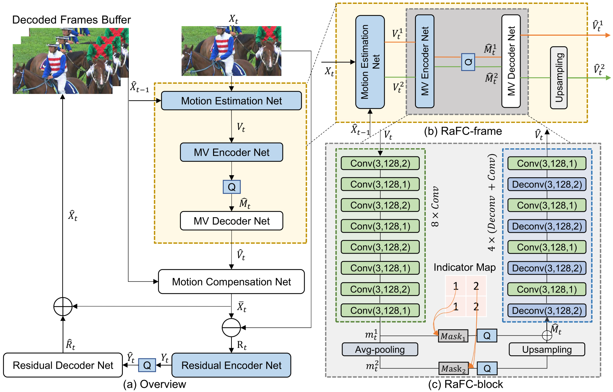
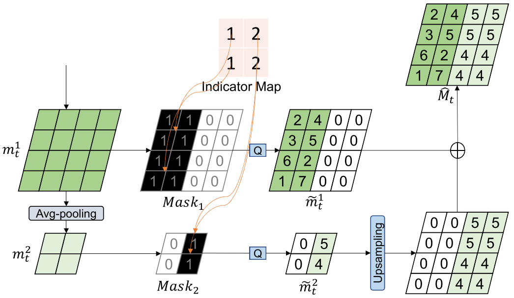

Improving Deep Video Compression by Resolution-Adaptive Flow Coding
=====================================

| **Year:** Sep 2020
| **Authors:** Zhihao Hu, Zhenghao Chen, Dong Xu, Guo Lu, Wanli Ouyang, Shuhang Gu
| **Affiliations:** Beihang University, The University of Sydney, Beijing Institute of Technology

Previous video compression frameworks adopt single representations for both input flow maps and output motion features using a single motion vector (MV) encoder. The authors argue that this cannot effectively handle complex or simple motion patterns in different scenes and fast or slow movement of objects.

In this work, the authors propose a new framework called Resolution-adaptive Flow Coding (RaFC), which can adopt multi-resolution representations for both flow maps and motion features and then automatically decide the optimal resolutions at both frame-level and block-level in order to achieve the optimal rate-distortion trade-off.

Experiment results on four benchmark datasets, HEVC, VTL, UVG, and MCL-JCV, demonstrates the overall RaFC framework outperforms the baseline algorithms including H.264, H.265, and DVC.

System Overview
-------------------------------------

The overall coding procedure is summarized in the following steps:

**Motion coding.** The RaFC method is utilized for motion coding. RaFC consists of three modules, motion estimation net, the motion vector (MV) encoder net, and the MV decoder net.
    * The **motion estimation net** estimates the optical flow :math:`V_t` between the input frame :math:`X_t` and the previous reconstructed frame :math:`\hat{X}_{t-1}`.
    * The **MV encoder** encodes the optical flow maps as motion feautres/representations :math:`M_t`, which is further quantized as :math:`\hat{M}_t` before entropy coding.
    * The **MV decoder** decodes the motion representation :math:`\hat{M}_t` so that the reconstructed flow map :math:`\hat{V}_t` is obtained.

**Motion copmensation.** Based on :math:`\hat{V}_t` and :math:`\hat{X}_{t-1}`, a motion compensation network predicts :math:`\bar{X}_t`.

**Residual coding.** Let :math:`R_t` be the residual between :math:`X_t` and :math:`\bar{X}_t`. A residual encoder encodes the :math:`R_t` as :math:`Y_t` and then quantized as :math:`\hat{Y}_t` for entropy coding. A residual decoder network reconstructs :math:`\hat{R}_t` from :math:`\hat{Y}_t`.

**Frame reconstruction.** The final reconstructed frame is obtained by :math:`\hat{X}_t = \bar{X}_t + \hat{R}_t`.

**Quantization and Bit Estimation.** The authors follow the method in [1] and add uniform noise to approximate quantization in the training stage. They use the bitrate estimation network in [1] to estimate the entropy encoding bits.

Problem Formulation
-------------------------------------

Let :math:`X = \{X_1, \dots, X_{t-1}, X_t, \dots\}` be the input video sequence to be compressed, where :math:`X_t \in \mathbb{R}^{W \times H \times C}`. The video encoder will generate the corresponding bitstreams, while the deocder reconstructs the video sequences using the received bitstreams. The objective of the learning based video compression system is formulated as follows,

.. math::

   RD = R + \lambda D = (\mathbb{H}(\hat{M}_t) + \mathbb{H}(\hat{Y}_t)) + \lambda d(X_t, \hat{X}_t)

where :math:`d(\cdot)` represents the metric, MSE or MS-SSIM. The **rate-distortion optimization** (RDO) procedure is summarized as follows,

.. math::

   \mathcal{M} = \text{argmin}_{i \in \mathcal{C}} RD_i

where :math:`\mathcal{C}` represents the candidate modes for coding block. In the RaFC framework, the key idea is to use the RDO technique to select the optimal resolution of optical flow maps or motion features at each block for the current frame.

Resolution-Adaptive Flow Coding (RaFC)
-------------------------------------

(a) Frame-Level Scheme RaFC-Frame
^^^^^^^^^^^^^^^^^^^^^^^^^^^^^^^^^^^^^

Given :math:`X_t` and :math:`\hat{X}_{t-1}`, the motion estimation network is utilized to generate multi-scale flow maps. Taking advantage of the existing pyramid architecture in Spynet [2], the authors generate two flow maps :math:`V_t^1` and :math:`V_t^2` with resolutions :math:`W \times H` and :math:`W/2 \times H/2`.

By calculating the rate-distortion (RD) value for :math:`V_t^1` and :math:`V_t^2`, the optimal flow map with the minimum RD value is selected.

(b) Block-Level Scheme RaFC-Block
^^^^^^^^^^^^^^^^^^^^^^^^^^^^^^^^^^^^^

It is necessary to design an efficient multi-scale motion features to handle different types of motion patterns. As shown in the figure below, given the optical flow map :math:`V_t` (:math:`V_t^1` or :math:`V_t^2`), we first feed the optical flow map :math:`V_t` to generate the multi-scale motion features :math:`m_t^1` and :math:`m_t^2`. Then the proposed RaFC-block method will select the optimal resolutino of the motion features for each block based on the RDO technique:
    - Indicator map geneartion
    - Motion feature reorganization

.. image:: figures/improv-dvc-by-res-adap-flow-coding-2.png
   :width: 320pt

References
-------------------------------------

**[1]** Ballé, J., Minnen, D., Singh, S., Hwang, S. J., & Johnston, N. (2018). Variational image compression with a scale hyperprior. arXiv preprint arXiv:1802.01436.

**[2]** Ranjan, A., & Black, M. J. (2017). Optical flow estimation using a spatial pyramid network. In Proceedings of the IEEE Conference on Computer Vision and Pattern Recognition (pp. 4161-4170).
