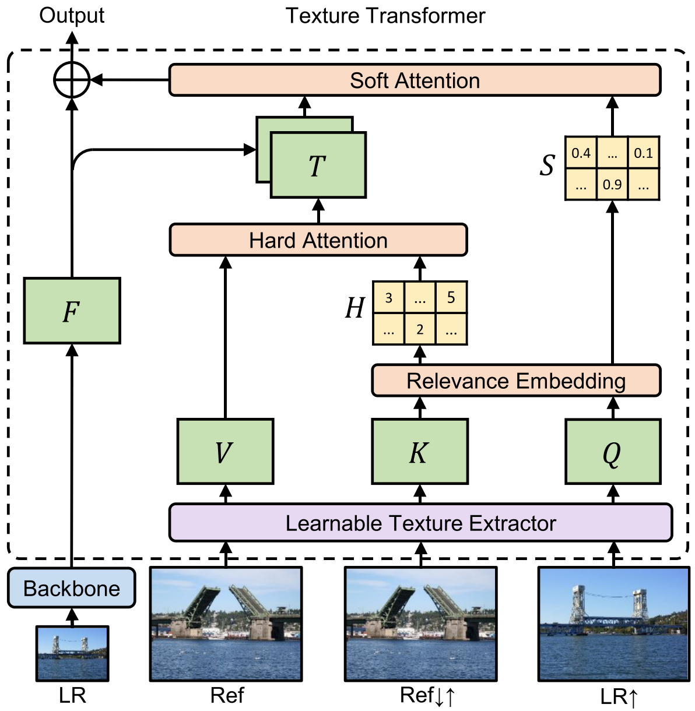

Learning Texture Transformer Network for Image Super-Resolution
=====================================

| **Year:** Jun 2020
| **Authors:** Fuzhi Yang, Huan Yang, Jianlong Fu, Hongtao Lu, Baining Guo
| **Affiliations:** Shanghai Jiao Tong University, MSRA

Image super-resolution (SR) is the task of recovering realistic textures from a low-resolution (LR) image. Recent progress has been made by taking high-resolution images as references (Ref), so that relevant textures can be transferred to LR images.

Existing SR approaches neglect to use attention mechanisms to transfer high-resolution (HR) textures from Ref images. In this work, the authors propose a novel Texture Transformer Network for Image Super Resolution (TTSR). It consists of four closely-related modules optimized for image generation tasks:

- a learnable texture extractor
- a relevance embedding module
- a hard-attention module and a soft-attention module

Experiments show that TTSR achieves significant improvements over SOTA approaches.

Texture Transformer
-------------------------------------

LR, LR :math:`\uparrow`, and Ref represent the input image, the 4x bicubic-upsampled input image, and the reference image. We obtain Ref :math:`\downarrow\uparrow` by downsampling and then upsampling the reference image, which is dominant-consistent with LR :math:`\uparrow`. The architecture overview is shown below.

**Learnable Texture Extractor.** The authors use a learnable texture extractor to encourage a joint feature learning across teh LR and Ref image.

.. math::

   Q & = \text{LTE}(LR\uparrow) \\
   K & = \text{LTE}(Ref\downarrow\uparrow) \\
   V & = \text{LTE}(Ref)

**Relevance Embedding.** Relevance embedding aims to embed the relevance between the LR and Ref iamge by estimating the similarity between :math:`Q` and :math:`K`. The authors first unfold :math:`Q` and :math:`K` into patches

.. math::

   & q_i, \; i \in [1, H_{LR} \times W_{LR}] \\
   & k_j, \; j \in [1, H_{Ref} \times W_{Ref}]

Then the relevance :math:`r_{i, j}` is estimated by the normalized inner product:

.. math::

   r_{i, j} = \left\langle \frac{q_i}{\lVert q_i \rVert}, \frac{k_j}{\lVert k_j \rVert} \right\rangle

**Hard Attention.** The hard-attention module transfer teh HR texture features :math:`V` from the Ref image. To avoid blurry results, only features from the most relevant position in :math:`V` are transferred. The hard-attention map :math:`H` is calculated by:

.. math::

   h_i = \text{argmax}_j r_{i, j}

The transferred HR texture features :math:`T` is simply selected from the :math:`h_i` position in :math:`V`.

**Soft Attention.** The soft-attention module synthesize features from the transferred HR texture features :math:`T` and the LR features :math:`F`. The soft-attention map :math:`S` is computed by:

.. math::

   s_i = \max_j r_{i, j}

The fusion operation is represented as:

.. math::

   F_{out} = F + \text{Conv}(\text{Concat}(F, T)) \bigodot S

Cross-Scale Feature Integration
-------------------------------------

Loss Function
-------------------------------------

The loss function is the sum of the reconstruction loss, the adversarial loss, and the perceptual loss:

.. math::

   \mathcal{L} = \lambda_{rec}\mathcal{L}_{rec} + \lambda_{adv}\mathcal{L}_{adv} + \lambda_{per}\mathcal{L}_{per}
