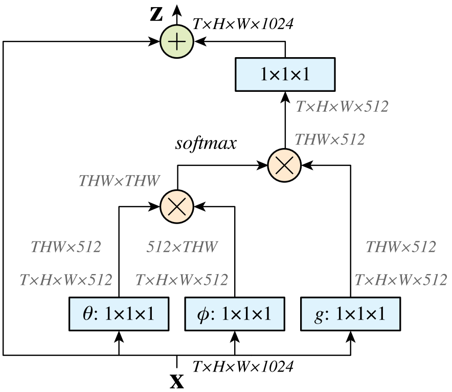

Non-Local Neural Networks
======================================

| **Year:** Nov 2017
| **Authors:** Xiaolong Wang, Ross Girshick, Abhinav Gupta, Kaiming He
| **Affiliations:** Carnegie Mellon University, Facebook AI Research

Capturing long-range dependencies is of central importance in deep neural networks. Both convolution and recurrent operations are building blocks that process one local neighborhood at a time. Repeaing local operations have several limitations:

- it is computationally inefficient
- it causes optmization difficulties
- it makes multi-hop dependency modeling difficult

In this papre, the authors present non-local operations as a generic family of building blocks for capturing long-range dependencies. It is a generalization of the classical non-local mean operation [1].

Experiments on various benchmark datasets show that non-local models can compete or outperform SOTA methods on the task of video classification and image recognition.

Non-Local Neural Networks
--------------------------------------

Following the non-local mean opeartion [1], the authors define a generic non-local operation in deep neural networks as:

.. math::

   \mathbf{y}_i = \frac{1}{\mathcal{C}(\mathbf{x})} \sum_{\forall y} f(\mathbf{x}_i, \mathbf{x}_j)g(\mathbf{x}_j)

Here :math:`i` is the index of an output position whose response is to be computed, function :math:`f` computes a scalar (representing relationship such as affinity), and function :math:`g` computes a representation of the input signal.

A non-local operation can be used together with convolutional/recurrent layers to build a richer hierarchy that combines both non-local and local information.

Let :math:`g(\mathbf{x}_j) = W_g \mathbf{x}_j`, the authors present several instantiations:

**Gaussian.** We have:

.. math::

   f(\mathbf{x}_i, \mathbf{x}_j) = e^{\mathbf{x}_i^\top \mathbf{x}_j}, \;\;\; \mathcal{C}(\mathbf{x}) = \sum_{\forall j} f(\mathbf{x}_i, \mathbf{x}_j)

**Embedded Gaussian.** A simple exension is to compute similarity in an embedding space. We consider

.. math::

   f(\mathbf{x}_i, \mathbf{x}_j) = e^{\theta(\mathbf{x}_i)^\top \phi(\mathbf{x}_j)}, \;\;\; \theta(\mathbf{x}) = W_\phi \mathbf{x}, \;\;\; \phi(\mathbf{x}) = W_\theta \mathbf{x}_i, \;\;\; \mathcal{C}(\mathbf{x}) = \sum_{\forall j} f(\mathbf{x}

The authors argue that the self-attention moduel [2] is a special case of non-local operations in the embedded Gaussian version.

**Dot product.** We have

.. math::

   f(\mathbf{x}_i, \mathbf{x}_j) = \theta(\mathbf{x}_i)^\top \phi(\mathbf{x}_j), \;\;\; \mathcal{C}(\mathbf{x}) = N

**Concatenation.** We consider:

.. math::

   f(\mathbf{x}_i, \mathbf{x}_j) = \text{ReLU}(\mathbf{w}_f^\top [\theta (\mathbf{x}_i), \phi(\mathbf{x}_j)]), \;\;\; \mathcal{C}(\mathbf{x}) = N

where :math:`[\cdot, \cdot]` denotes concatenation.

Non-Local Block
--------------------------------------

A non-local block is defined as:

.. math::

   \mathbf{z}_i = W_z \mathbf{y}_i + \mathbf{x}_i

The residual connection allows us to insert a new non-local block into any pre-trained model, without breaking its initial behavior.

**Implementation of non-local blocks.** The authors set the number of channels represented by :math:`W_g`, :math:`W_\theta`, and :math:`W_\phi` to be half of the number of channels in :math:`\mathbf{x}`. This follows the bottlenect design of [3] and reduces the computation of a block by about a half.

A subsampling trick is used to further reduce computation. We have:

.. math::

   \mathbf{y}_i = \frac{1}{\mathcal{C}(\hat{\mathbf{x}})} \sum_{\forall j} f(\mathbf{x}_i, \hat{\mathbf{x}}_j)g(\hat{\mathbf{x}}_j)

where :math:`\hat{\mathbf{x}}` is a subsampled version of :math:`\mathbf{x}`.

References
--------------------------------------

**[1]** Buades, A., Coll, B., & Morel, J. M. (2005, June). A non-local algorithm for image denoising. In *2005 IEEE Computer Society Conference on Computer Vision and Pattern Recognition (CVPR'05)* (Vol. 2, pp. 60-65). IEEE.

**[2]** Vaswani, A., Shazeer, N., Parmar, N., Uszkoreit, J., Jones, L., Gomez, A. N., ... & Polosukhin, I. (2017). Attention is all you need. In *Advances in neural information processing systems* (pp. 5998-6008).

**[3]** He, K., Zhang, X., Ren, S., & Sun, J. (2016). Deep residual learning for image recognition. In Proceedings of the IEEE conference on computer vision and pattern recognition (pp. 770-778).
