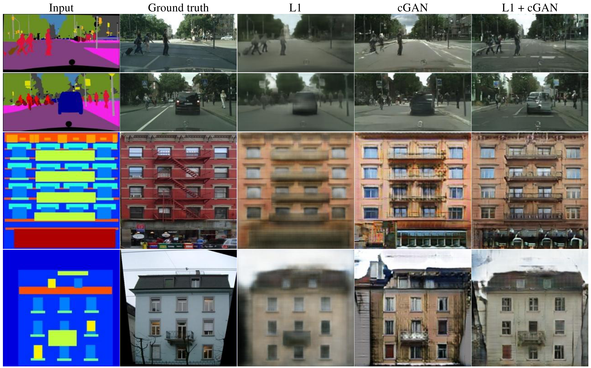

Image-to-Image Translation with Conditional Adversarial Networks (Pix2Pix)
=====================================

| **Authors:** Phillip Isola, Jun-Yan Zhu, Tinghui Zhou, Alexei A. Efros
| **Affiliations:** Berkeley AI Research Laboratory

The authors define **automatic image-to-image translation** as the task of translating one possible representation of a scene into another, given sufficient data. Whatever the taks is, the setting is always the same: predict pixels from pixels.

In this work, the authors develop a cGAN (conditional GAN) framework sufficient to achieve good results for all these problems. The model conditions on an input image and generates a corresponding output image.

.. image:: figures/pix2pix.rst
   :width: 520pt

Method
-------------------------------------

The objective of a conditional GAN can be expressed as

.. math::

   & \min_G\max_D \mathcal{L}_\text{cGAN}(G, D) \\
   & \mathcal{L}_\text{cGAN}(G, D) = \mathbb{E}_{x,y}[\log D(x, y)] + \mathbb{E}_{x,z}[\log(1 - D(x, G(x, z))]

Previous approaches have found it beneficial to mix the GAN objective with a more tranditional loss. The authors use L1 distance rather than L2 distance to encourage less blurring. The final objective is:

.. math::

   \min_G\max_D \mathcal{L}_\text{cGAN}(G, D) + \lambda \mathcal{L}_{L1}(G)

In some GANs, Gaussian noise :math:`z` is provided as an input to the generator. The authors didn't find this strategy effective (the noise is ignored by the generator), and instead provide noise in the form of dropout.

The authors note that despite the dropout noise, they observe minor stochasticity in the output. Designing conditional GANs that produce highly stochastic output, and thereby capture the full entropy of the conditional distributions they model, is an important question left open by the present work.

The figure below gives an overview of the architecture.

.. image:: figures/pix2pix.png
   :width: 400pt

Network Architecture
-------------------------------------

The network architectures are adopted from **Unsupervised Representation Learning with Deep Convolutional Generative Adversarial Networks**.

The authors note that for many image-to-image translation problems, the input and output differ in surface appearance, but both are renderings of the same underlying structure. For an encoder-decoder network, a great deal of low-level information is shared between the input and output and should circumvent the bottleneck of the network. Therefore, they add skip connections, following the general shape of a U-Net.

Markovian discriminator (PatchGAN)
-------------------------------------

The authors argue that although L1 losses fail to encourage high-frequency crispness, they nonetheless accurately capture the low frequencies. Hence they design a new discriminator architecture to only model high-frequency structure, namely PatchGAN. It only penalizes structure at the scale of :math:`N \times N` patches.

Such a discriminator effectively models the image as a Markov random field, assuming independence between pixels separated by more than a path diameter. Therefore, PatchGAN can be understood as a form of texture/style loss.

Inference
-------------------------------------

At inference time, the authors run the generator net exactly the same as during the training phase. Dropout and batch normalization (or instance normalization) using the statistics of the test batch is applied.

