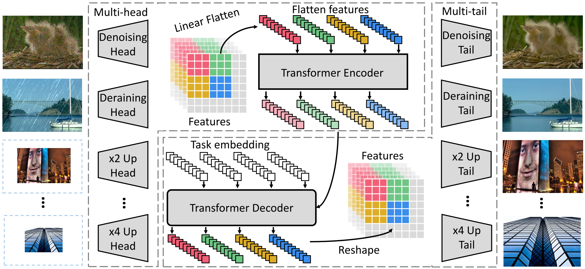

Pre-Trained Image Processing Transformer
=====================================

| **Year:** Dec 2020
| **Authors:** Hanting Chen, Yunhe Wang, Tianyu Guo, Chang Xu, Yiping Deng, Zhenhua Liu, Siwei Ma, Chunjing Xu, Chao Xu, Wen Gao
| **Affiliations:** Peking University, Huawei Technologies, The University of Sydney, Peng Cheng Laboratory

Pre-training has the potential to provide an attractive solution to image processing tasks by addressing the following two challenges:

1. Task-specific data can be limited.
2. It is unknown which type of image processing job will be requested until the test image is presented.

In this paper, the authors study the low-level computer vision task (e.g., denoising, super-resolution, and deraining) and develop a new pre-trained model, namely, **Image Processing Transformer** (IPT). In order to be compatible with different image processing tasks, the entire network is composed of multiple pairs of head and tail corresponding to different tasks and a single shared body. The proposed IPT is learned in an end-to-end manner on ImageNet.

With only one pre-trained model, IPT outperforms the current SOTA methods on various low-level benchmarks.

IPT Architecture
-------------------------------------

The overall architecture of IPT consists of four components:

- heads for extracting features from the input corrupted images
- an encoder-decoder transformer for recovering the missing information in input data
- tails for formapping the features into restored images

**Heads.** Denote the input image as :math:`x \in \mathbb{R}^{3 \times H \times W}`. The head generates a feature map :math:`f_H \in \mathbb{R}^{C \times H \times W}`. (Typically, :math:`C = 64`.) The calculation can be formulated as:

.. math::

   f_H = H^i(x), \; i \in \{1, \dots, N_t\}

**Transformer encoder.** Features :math:`f_H \in \mathbb{R}^{C \times H \times W}` are reshaped into a sequence of patches ("words"), :math:`f_{p_i} \in \mathbb{R}^{P^2 \times C}`, :math:`i \in \{1, \dots, N = \frac{HW}{P^2}\}`. To maintain the position information, the authors add learnable position encodings :math:`E_{p_i} \in \mathbb{R}^{P^2 \times C}` for each patch for feature :math:`f_{p_i}` following [1, 2], and :math:`E_{p_i} + f_{p_i}` is directly input into the transformer encoder.

The architecture of encoder layer is following the original structure in [3], which has a multi-head self-attention module and a feed forward network. The output of encoder for each patch is :math:`f_{E_i} \in \mathbb{R}^{P^2 \times C}`. The calculation can be formulated as

.. math::

   & y_0 = [E_{p_1} + f_{p_1}, \dots, E_{p_N} + f_{p_N}] \\
   & q_i = k_i = v_i = LN(y_{i-1}) \\
   & y_i' = MSA(q_i, k_i, v_i) + y_{i-1} \\
   & y_i = FFN(LN(y_i')) + y_i', \; i = 1, \dots, l \\
   & [f_{E_1}, \dots, f_{E_N}] = y_l

where :math:`l` denotes the number of layers in the module, MSA denotes the multi-head self-attention module, and FFN denotes the feed forward network with two fully-connected layers.

**Transformer decoder.**

**Tails.**

References
-------------------------------------

**[1]** Dosovitskiy, A., Beyer, L., Kolesnikov, A., Weissenborn, D., Zhai, X., Unterthiner, T., ... & Houlsby, N. (2020). An image is worth 16x16 words: Transformers for image recognition at scale. arXiv preprint arXiv:2010.11929.

**[2]** Carion, N., Massa, F., Synnaeve, G., Usunier, N., Kirillov, A., & Zagoruyko, S. (2020). End-to-End Object Detection with Transformers. arXiv preprint arXiv:2005.12872.

**[3]** Vaswani, A., Shazeer, N., Parmar, N., Uszkoreit, J., Jones, L., Gomez, A. N., ... & Polosukhin, I. (2017). Attention is all you need. In Advances in neural information processing systems (pp. 5998-6008).
