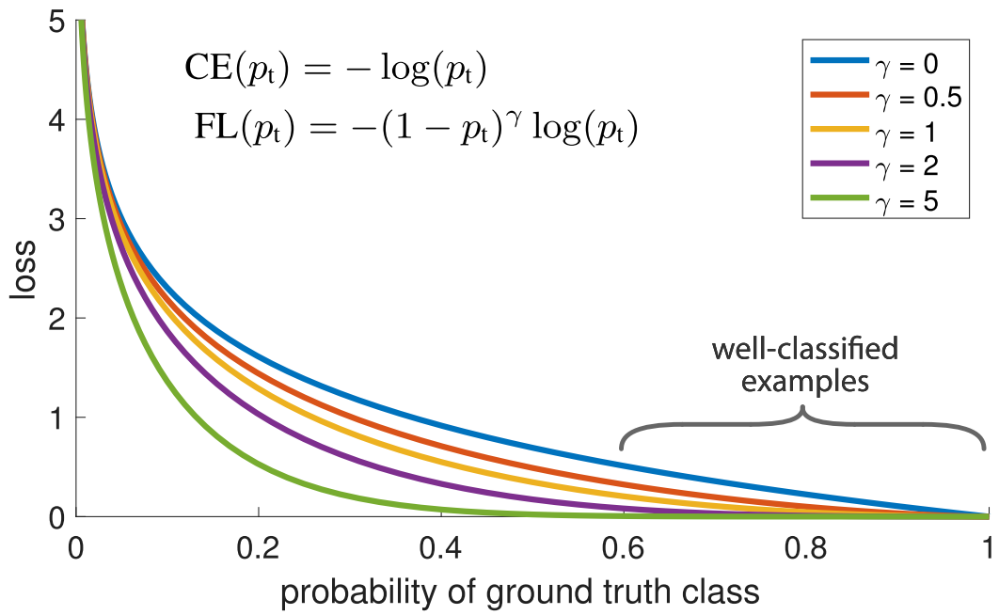
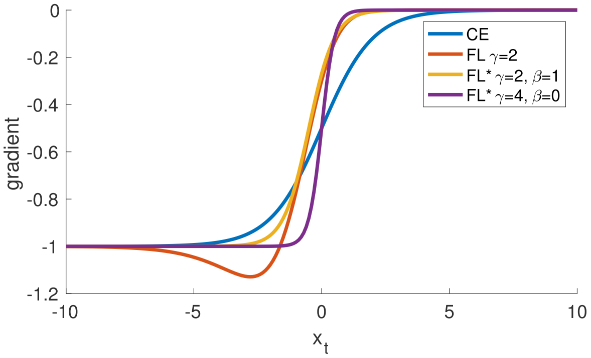
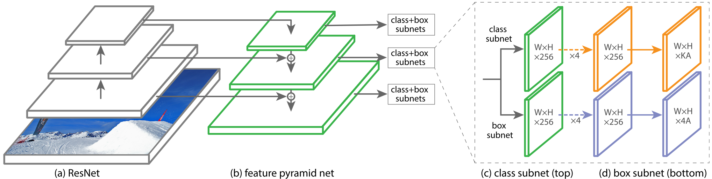

Focal Loss for Dense Object Detection (RetinaNet)
=====================================

| **Authors:** Tsung-Yi Lin, Priya Goyal, Ross Girshick, Kaiming He, Piotr Dollar
| **Affiliations:** Facebook AI Research

In this paper, the authors discover that the central cause why one-stage detectors have trailed the accuracy of two-stage detectors is the extreme foreground-backgruond class imbalance encountered during training of dense detectors. They propose **Focal Loss** that focuses training on a sparse set of hard examples and prevents the vast number of easy negatives from overwhelming the detector during training.

To evaluate the effectiveness of the loss, they design and train a simple dense detector called **RetinaNet**. Experiments on the COCO dataset show that RetinaNet trained with focal loss achieves SOTA speed and accuracy.

Focal Loss
-------------------------------------

Let's first consider the binary cross entropy (CE) loss:

.. math::

   \text{CE}(p, y) = \begin{cases} -\log(p) & \text{if } y = 1 \\ -\log(1-p) & \text{otherwise} \end{cases}

For notational convenience, we define :math:`p_t`:

.. math::

   p_t = \begin{cases} p & \text{if } y = 1 \\ 1 - p & \text{otherwise} \end{cases}

and rewrite :math:`\text{CE}(p, y) = \text{CE}(p_t) = -\log(p_t)`.

A simple extension is the **balanced cross entropy** which introduce a weighting factor :math:`\alpha`. In practice :math:`\alpha` may be set by inverse class frequency or treated as a hyperparameter to set by cross validation. We write the :math:`\alpha`-balanced CE loss as:

.. math::

   \text{CE}(p_t) = - \alpha_t \log(p_t)

where

.. math::

   \alpha_t = \begin{cases} \alpha & \text{if } y = 1 \\ 1 - \alpha & \text{otherwise} \end{cases}

The **focal loss** is designed to address the extreme imbalance between foreground and background classes during training. While :math:`\alpha` balances the importance of positive/negative examples, it does not differentiate between easy/hard examples. The authors propose to add a modulating factor :math:`(1 - p_t)^\gamma` to the cross entropy loss, with tunable **focusing parameter** :math:`\gamma \geq 0`. The focal loss is defined as:

.. math::

   \text{FL}(p_t) = - (1 - p_t)^\gamma \log(p_t)

There are two properties of focal loss:
  1. As :math:`p_t` goes to :math:`1`, the factor :math:`(1 - p_t)^\gamma` goes to :math:`0` and the loss is down-weighted.
  2. :math:`\gamma` smoothly adjusts the rate at which easy examples are down-weighted. (The authors found :math:`\gamma = 2` to work the best in experiments.)

In practice they use an :math:`\alpha`-balanced variant of the focal loss:

.. math::

   \text{FL}(p_t) = -\alpha_t (1 - p_t)^\gamma \log(p_t)

The derivatives of the loss functions are plotted below:

RetinaNet Detector
-------------------------------------

As shown in the figure below, RetinaNet is a single, unified network composed of a backbone network and two task-specific subnetworks.

**Feature Pyramid Network Backbone:** The authors adopt the FPN from *Feature Pyramid Networks for Object Detection* as the backbone network for RetinaNet.

**Anchors:** The authors use translation-invariant anchor boxes similar to those in the RPN variant in *Feature Pyramid Networks for Object Detection*.

**Classification Subnet:** The classification subnet predicts the probability of object presence at each spatial position for each of the :math:`A` anchors and :math:`K` object classes. This subnet is a small FCN attached to each FPN level; parameters of this subnet are shared across all pyramid levels.

**Box Regression Subnet:** In parallel with the object classification subnet, another small FCN is attached to each pyramid level for the purpose of regressing the offset from each anchor box to a nearby ground-truth object.

**Initialization:** For the final conv layer of the classification subnet, the bias initialization is set to :math:`b = - \log((1 - \pi) / \pi)`, where :math:`\pi` specifies that at the start of training every anchor should be labeled as foreground with confidence of :math:`\sim \pi`. This initialization prevents the large number of background anchors from generating a large, destabilizing loss value in the first iteration of training.

Results
-------------------------------------

**OHEM:** OHEM is another approach to put more emphasis on misclassified examples. But unlike FL, OHEM completely discards easy examples. Experiments show that FL achieve better results (for around 3.2 AP) than OHEM.
