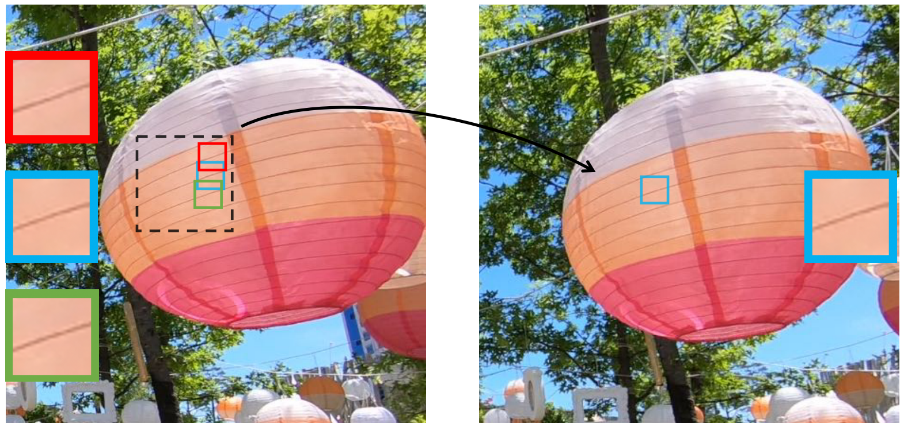
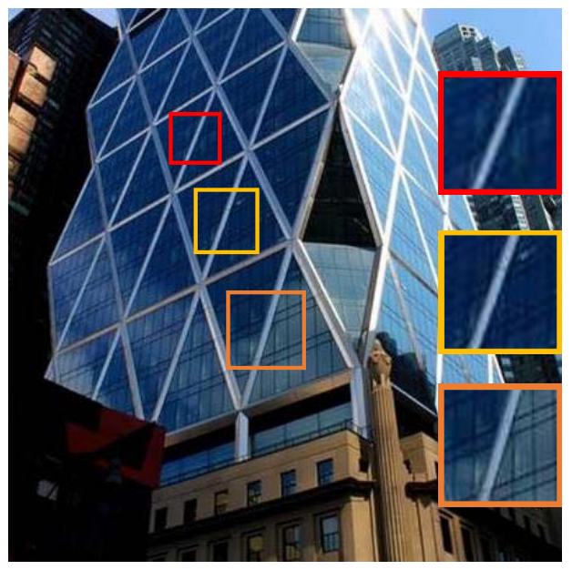
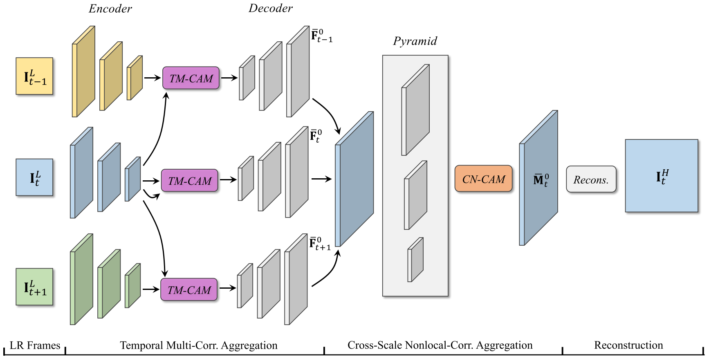
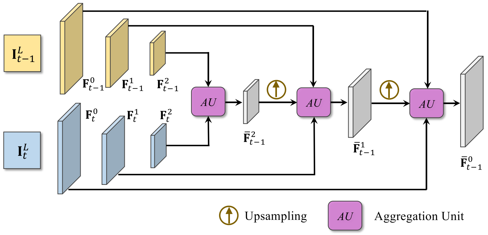
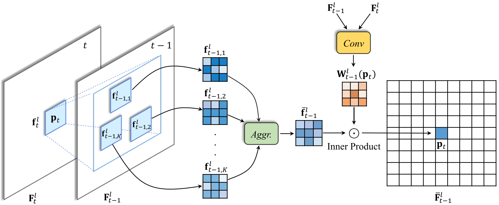
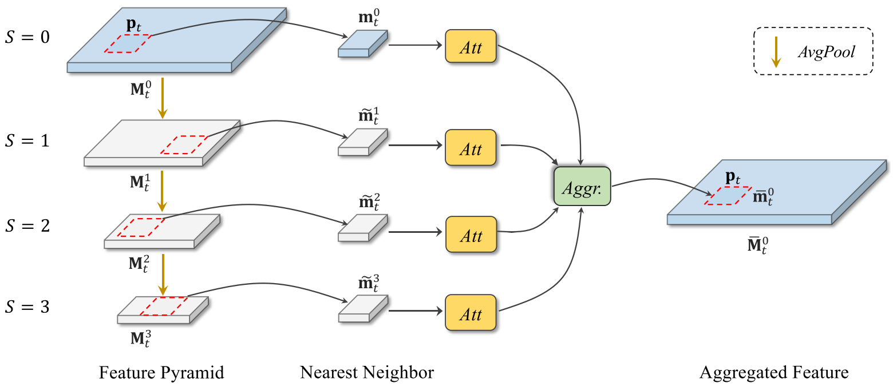

MuCAN: Multi-Correspondence Aggregation Network for Video Super-Resolution
=====================================

| **Year:** Jul 2020
| **Authors:** Wenbo Li, Xin Tao, Taian Guo, Lu Qi, Jiangbo Lu, Jiaya Jia
| **Affiliations:** The Chinese University of Hong Kong, Kuaishou Tech, Tsinghua University, SmartMore

Video super-resolution (VSR) aims to utilize multiple low-resolution frames to generate a high-resolution prediction for each frame. The authors argues that there are two main limitations for existing VSR methods:

- Flow estimation is error-prone and affects recovery results.
- Similar patterns in natural images are rarely exploited.

In this work, the authors propose the multi-correspondence aggregation network (MuCAN) for VSR. This method achieves SOTA results on multiple benchmark datasets.

In contrast to previous methods that model VSR as separate alignment and regression stages, the authors view this problem as an inter- and intra-frame correspondence aggregation task.

- **Inter-frame correspondence:** Motion estimation may suffer from inevitable errors so the authors resort to simultaneously consider multiple correspondence candidates for each pixel. They propose a **temporal multi-correspondence aggregation module** (TM-CAM) for alignment.

- **Intra-frame correspondence:** Similar pattern within each frame can benefit detail restoration. The authors design a new **cross-scale nonlocal-correspondence aggregation module** (CN-CAM) to exploit multi-scale self-similarity property.

Proposed Method
-------------------------------------

Given :math:`2N + 1` consecutive low-resolution frames :math:`\{\mathbf{I}_{t-N}^L, \dots, \mathbf{I}_t^L, \dots, \mathbf{I}_{t+N}^L\}`, MuCAN predicts a high-resolution central image :math:`\mathbf{I}_t^H`. It consists of three modules: TM-CAM, CXN-CAM, and a reconstruction module.

Temporal Multi-Correspondence Aggregation Module (TM-CAM)
-------------------------------------

The authors design a hierarchical correspondence aggregation strategy to handle large and subtle motion simultaneously.

Given two neighboring low resolution images :math:`\mathbf{I}_{t-1}^L` and :math:`\mathbf{I}_t^L`, they first encode them into lower resolutions. Then the aggregation starts in the lower resolution stage compensating large motion, while progressively moving up to higher resolution stages for subtle sub-pixel shift.

The authors use correlation as the distance measure:

.. math::

   \text{corr}(\mathbf{f}_{t-1}^l, \mathbf{f}_t^l) = \frac{\mathbf{f}_{t-1}^l}{\lVert \mathbf{f}_{t-1}^l \rVert} \cdot \frac{\mathbf{f}_t^l}{\lVert \mathbf{f}_t^l \rVert}

By calculating correlations, we can find the top-K most correlated patches (in a local search area) in a descending order, and concatenate and aggregate them using convolution layers. In order to enable varying aggregation patterns in different locations, they further introduce a weight map obtained by concatenating the feature maps and going through a convolution layer.

Finally, the value at position :math:`\mathbf{p}_t` on the aligned neighboring frame :math:`\bar{\mathbf{F}}_{t-1}^l` is obtained as

.. math::

   \bar{\mathbf{F}}_{t-1}^l (\mathbf{p}_t) = \bar{\mathbf{f}}_{t-1}^l \cdot \mathbf{W}_{t-1}^l(\mathbf{p}_t)

Cross-Scale Nonlocal-Correspondence Aggregation Module (CN-CAM)
-------------------------------------

With average pooling, the authors first downsampling the input features maps and obtain a feature pyramid. Given a query patch in :math:`\mathbf{M}_t^0`, the nearest neighbor patch is found in each stage. Further, a self-attention module [1] is applied to determine whether the information is useful.

Finally, the aggregated feature :math:`\bar{\mathbf{m}}_t^0` at position :math:`\mathbf{p}_t` is calculated as:

.. math::

   \bar{\mathbf{m}}_t^0 = \text{Aggr}([\text{Att}(\mathbf{m}_t^0), \text{Att}(\tilde{\mathbf{m}}_t^1), \text{Att}(\tilde{\mathbf{m}}_t^2), \text{Att}(\tilde{\mathbf{m}}_t^3)])

Edge-Aware Loss
-------------------------------------

References
-------------------------------------

**[1]**
