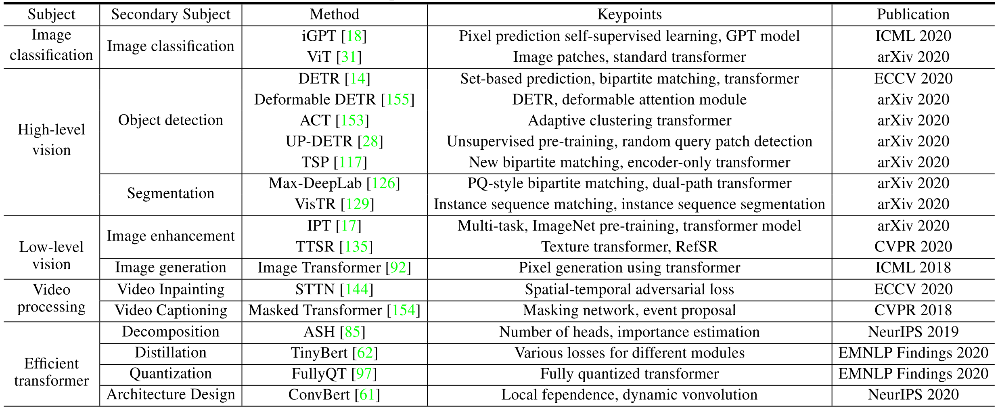
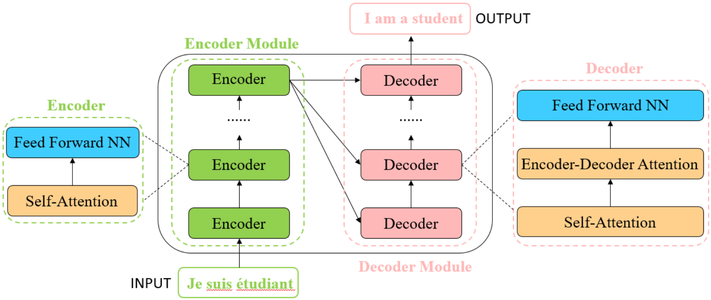
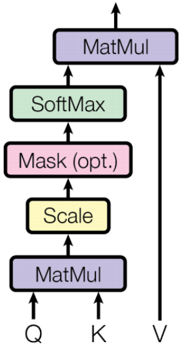
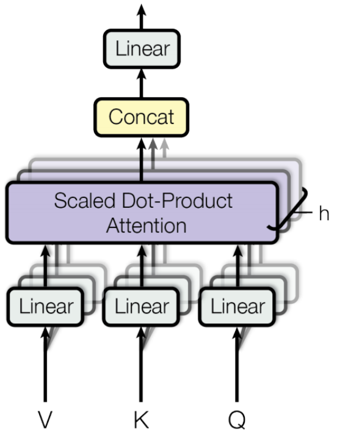

A Survey on Visual Transformer
=====================================

| **Year:** Dec 2020
| **Authors:** Kai Han, Yunhe Wang, Hanting Chen, Xinghao Chen, Jianyuan Guo, Zhenhua Liu, Yehui Tang, An Xiao, Chunjing Xu, Yixing Xu, Zhaohui Yang, Yiman Zhang, Dacheng Tao
| **Affiliations:** Noah's Ark Lab, Peking University, University of Sydney

Transformer is originally applied on natural language processing (NLP) tasks and brings in significant improvement [1, 2, 3]. Inspired by the power of transformer in NLP, recently researchers extend transformer for computer vision (CV) tasks.

In this paper, the authors provide a literature review of these visual transformer models by categorizing them in different tasks and analyze the advantages and disadvantages of these methods. The table below lists the representative works of visual transformers.

Formulation of Transformer
-------------------------------------

As shown in the figure below, transformer consists of an encoder module and a decoder module with several encoders/decoders of the same architecture. Each encoder is composed of a self-attention layer and a feed-forward neural network, while each decoder is composed of a self-attention layer, an encoder-decoder attention layer and a feed-forward neural network. Before feeding into the transformer, each "word" is embedded into a vector with :math:`d_{model} = 512` dimensions.

Self-Attention Layer
^^^^^^^^^^^^^^^^^^^^^^^^^^^^^^^^^^^^^

In self-attention layer, the input vector is firstly transformed into three different vectors, the query vector :math:`q`, the key vector :math:`k`, and the value vector :math:`v` with the same dimension :math:`d_q = d_k = d_v = d_{model} = 512`. Vectors derived from different inputs are then packed together into three different matrices, :math:`Q`, :math:`K`, and :math:`V`. As shown in the figure below, the attention function between different input vectors is calculated with the following steps:

- **Step 1:** Compute scores between input vectors: :math:`S = Q \cdot K^\top`. The score is to determine the degree of attention we put on other words when encoding the current word.
- **Step 2:** Normalize the scores for the stability of gradient with :math:`S_n = S / \sqrt{d_k}`.
- **Step 3:** Translate the scores into probabilities with softmax function :math:`P = softmax(S_n)`.
- **Step 4:** Get the weighted value matrix with :math:`Z = V \cdot P`.

The process can be formulated as:

.. math::

   Attention(Q, K, V) = softmax\left( \frac{Q \cdot K^\top}{\sqrt{d_k}} \right) \cdot V

To capture the positional information of each word, a positional encoding with dimension :math:`d_{model}` is added to the original input embedding:

.. math::

   PE(pos, 2i) & = \sin \left( \frac{pos}{10000^{\frac{2i}{d_{model}}} \right) \\
   PE(pos, 2i + 1) & = \cos \left( \frac{pos}{10000^{\frac{2i}{d_{model}}} \right)

where :math:`i` is the current dimension of the positional encoding.

Multi-Head Attention
^^^^^^^^^^^^^^^^^^^^^^^^^^^^^^^^^^^^^

References
-------------------------------------

**[1]** Vaswani, A., Shazeer, N., Parmar, N., Uszkoreit, J., Jones, L., Gomez, A. N., ... & Polosukhin, I. (2017). Attention is all you need. In Advances in neural information processing systems (pp. 5998-6008).

**[2]** Devlin, J., Chang, M. W., Lee, K., & Toutanova, K. (2018). Bert: Pre-training of deep bidirectional transformers for language understanding. arXiv preprint arXiv:1810.04805.

**[3]** Brown, T. B., Mann, B., Ryder, N., Subbiah, M., Kaplan, J., Dhariwal, P., ... & Amodei, D. (2020). Language models are few-shot learners. arXiv preprint arXiv:2005.14165.
