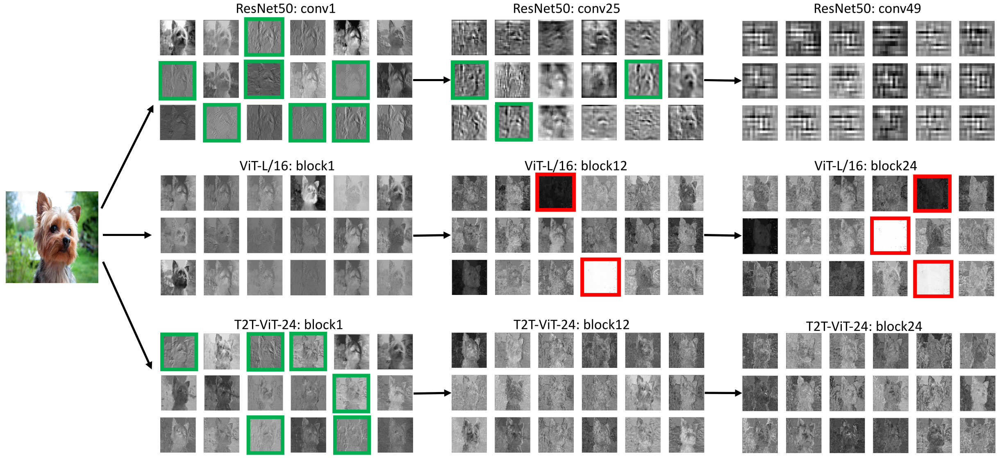

Tokens-to-Token ViT: Training Vision Transformers from Scratch on ImageNet
=====================================

| **Authors**: Li Yuan, Yunpeng Chen, Tao Wang, Weihao Yu, Yujun Shi, Francis EH Tay, Jiashi Feng, Shuicheng Yan
| **Affiliations**: National University of Singapore, YITU Technology

The ViT model splits each image into a sequence of tokens with fixed length and then applies multiple Transformer layers to model their global relation for classification. However, ViT achieves inferior performance compared with CNNs when trained from scratch on a midsize dataset (e.g., ImageNet). The authors found it is because:

1. the simple tokenization of input images fails to model the important local structure among neighboring pixels, leading to its low training sample efficiency;
2. the redundant attention backbone design of ViT leads to limited feature richness in fixed computation budgets and limited training samples.

To overcome such limitations, the authors propose a new Tokens-To-Token Vision Transformers (T2T-ViT), which introduces:

1. a layer-wise Tokens-To-Token (T2T) transformation to progressively structurize the image to tokens by recursively aggregating neighboring tokens into one token
2. an efficient backbone with a deep-narrow structure for vision transformers motivated by CNN architecture design

Feature Visualization of ViT and ResNet
-------------------------------------

The authors conduct a study to investigate the difference in the learned features of ViT-L/16 and ResNet50 through visualization. Instead of capturing the desired local structures progressively, ViT can poorly model the structures and the global relations are captured by all the attention blocks.

Tokens-To-Token ViT
-------------------------------------

T2T-ViT consists of two main components:

1. a layer-wise Tokens-To-Token module to model the local structure information of images and reduce the length of tokens progressively
2. an efficient T2T-ViT backbone to draw the global attention relations on the tokens from T2T module
