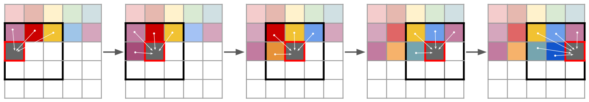

Taming Transformers for High-Resolution Image Synthesis
=====================================

| **Year:** Dec 2020
| **Authors:** Patrick Esser, Robin Rombach, Bjorn Ommer
| **Affiliations:** Heidelberg University

In contrast to CNNs, Transformers contain no inductive bias that prioritizes local interactions. The authors show how to (i) use CNNs to learn a context-rich vocabulary of image constituents, and in turn (ii) utilize transformers to efficiently model their composition within high-resolution images.

The authors apply this approach to conditional synthesis tasks, where both non-spatial information and spatial information can control the generated image. The authors present the first results on semantically-guided synthesis of megapixel images with transformers at `https://git.io <https://git.io/JLlvY>`_.

Approach
-------------------------------------

High-resolution image synthesis requires a model that understands the global composition of images, enabling it to generate locally realistic as well as globally consistent patterns. The authors represent images as a composition of perceptually rich image constituents from a codebook, which can significantly reduce the description length of compositions and allows us to model the globl interrelations with a transformer.

Learning an Effective Codebook of Image Constituents
-------------------------------------

Complex necessitates an approach that uses a discrete codebook of learned representations, such that any image :math:`x \in \mathbb{R}^{H \times W \times 3}` can be represented by a spatial collection of codebook entries :math:`z_\mathbf{q} \in \mathbb{R}^{h \times w \times n_z}`.

First, the authors learn a convolutional model consisting of an encoder :math:`E` and a decoder :math:`G`, such that taken together, they learn to represent images with codes from a learned, discrete codebook :math:`\mathcal{Z} = \{z_i\}_{k=1}^K \subset \mathbb{R}^{n_z}`. We have:

.. math::

   \hat{z} & = E(x) \in \mathbb{R}^{h \times w \times n_z} \\
   z_\mathbf{q} & = \mathbf{q}(\hat{z}) := \left( \arg\min_{z_k \in \mathcal{Z}} \left\lVert \hat{z}_{ij} - z_k \right\rVert \right) \in \mathbb{R}^{h \times w \times n_z} \\
   \hat{x} & = G(z_\mathbf{q}) = G(\mathbf{q}(E(x)))

Backpropagation through the non-differentiable quantization operation is achieved by a straight-through gradient estimator, which copies the gradients from the decoder to the encoder. Hence the model and the codebook can be trained end-to-end via the loss function:

.. math::

   \mathcal{L}_\text{VQ} (E, G, \mathcal{Z}) = \left\lVert x - \hat{x} \right\rVert_2^2 + \left\lVert \text{sg}[E(x)] - z_\mathbf{q} \right\rVert_2^2 + \beta \left\lVert \text{sg}[z_\mathbf{q}] - E(x) \right\rVert_2^2

Here :math:`\text{sg}[\cdot]` denotes the stop-gradient operation, and the third term is the "commitment loss" in [1].

**Learning a Perceptually Rich Codebook.** Using transformers to represent images as a distribution over latent image constituents requires us to push the limits of compression and learn a rich codebook. The authors propose VQGAN, a variant of VQVAE [1], and use a discriminator and perceptual loss to keep good perceptual quality at increase compression rate.

.. math::

   \mathcal{L}_\text{GAN} (\{E, G, \mathcal{Z}\}, D) = [\log D(x) + \log (1 - D(\hat{x}))]

The complete objective for finding the optimal compression model :math:`\mathcal{Q}^* = \{E^*, G^*, \mathcal{Z}^*\}` then reads

.. math::

   \mathcal{Q}^* & = \arg \min_{E, G, \mathcal{Z}} \max_D \mathbb{E}_{x \sim p(x)} \left[ \mathcal{L}_\text{VQ}(E, G, \mathcal{Z}) + \lambda \mathcal{L}_\text{GAN}(\{E, G, \mathcal{Z}\}, D) \right] \\
   \lambda & = \frac{\nabla_{G_L} [\mathcal{L}_\text{rec}]}{\nabla_{G_L}[\mathcal{L}_\text{GAN}] + \delta}

where :math:`\mathcal{L}_{rec}` is the perceptual reconstruction loss [2] and :math:`\nabla_{G_L}[\cdot]` is denotes the gradient of its input w.r.t. the last layer :math:`L` of the decoder.

Learning the Composition of Images with Transformers
-------------------------------------

**Latent Transformers.** With :math:`E` and :math:`G` available, we can now represent images in terms of the codebook-indices of their encodings. The quantized encoding of an image :math:`x` is given by :math:`z_\mathbf{q} = \mathbf{q}(E(x)) \in \mathbb{R}^{h \times w \times n_z}` and is equivalent to a sequence :math:`s \in \{0, \dots, \lvert \mathcal{Z} \rvert - 1\}^{h \times w}` of indices.

After choosing some ordering of the indices in :math:`s`, image-generation can be formulated as autoregressive next-index prediction: Given indices :math:`s_{< i}`, the transformer learns to predict the distribution of possible next indices, i.e. :math:`p(s_i \mid s_{< i})` to compute teh likelihood of the full representation :math:`p(s) = \prod_i p(s_i \mid p_{< i})`. This allows us to maximize the log-likelihood of the data representations:

.. math::

   \mathcal{L}_\text{Transformer} = \mathbb{E}_{x \sim p(x)} [- \log p(s)]

**Conditioned Synthesis.** In many image synthesis tasks there is some additional information :math:`c` from which an example shall be synthesized. The task is then to learn the likelihood of the sequence given :math:`c`

.. math::

   p(s \mid c) = \prod_i p(s_i \mid s_{< i}, c)

If :math:`c` has spatial extent, then we learn another VQGAN to obtain an index-based representation :math:`r \in \{0, \dots, \lvert \mathcal{Z}_c \rvert - 1\}^{h_c \times w_c}`. Then we simply prepend :math:`r` to :math:`s` and restrict the computation of the negative log-likelihood to entries :math:`p(s_i \mid s_{< i}, r)`. This "decoder-only" strategy has also been used for text-summarization tasks [3].

**Generating High-Resolution Images.** The attention mechanism of the transformer puts limits on the sequence length :math:`h \cdot w`. When reducing image sizes to :math:`H/2^m \cdot W/2^m`, the authors observe degradation of the reconstruction quality beyond a value of :math:`m`.

The authors propose to work patch-wise and crop images to restrict the length of :math:`s` during training. To sampling images, they use the transformer in a sliding-window manner. This requires the dataset to be approximately spatially invariant or spatial conditioning information is available. When this is violated, we can simply condition on image coordiantes, similar to [4].

Reference
-------------------------------------

**[1]** Oord, A. V. D., Vinyals, O., & Kavukcuoglu, K. (2017). Neural discrete representation learning. *arXiv preprint arXiv:1711.00937*.

**[2]** Zhang, R., Isola, P., Efros, A. A., Shechtman, E., & Wang, O. (2018). The unreasonable effectiveness of deep features as a perceptual metric. In *Proceedings of the IEEE conference on computer vision and pattern recognition* (pp. 586-595).

**[3]** Liu, P. J., Saleh, M., Pot, E., Goodrich, B., Sepassi, R., Kaiser, L., & Shazeer, N. (2018). Generating wikipedia by summarizing long sequences. *arXiv preprint arXiv:1801.10198*.

**[4]** Lin, C. H., Chang, C. C., Chen, Y. S., Juan, D. C., Wei, W., & Chen, H. T. (2019). Coco-gan: Generation by parts via conditional coordinating. In *Proceedings of the IEEE/CVF International Conference on Computer Vision* (pp. 4512-4521).
