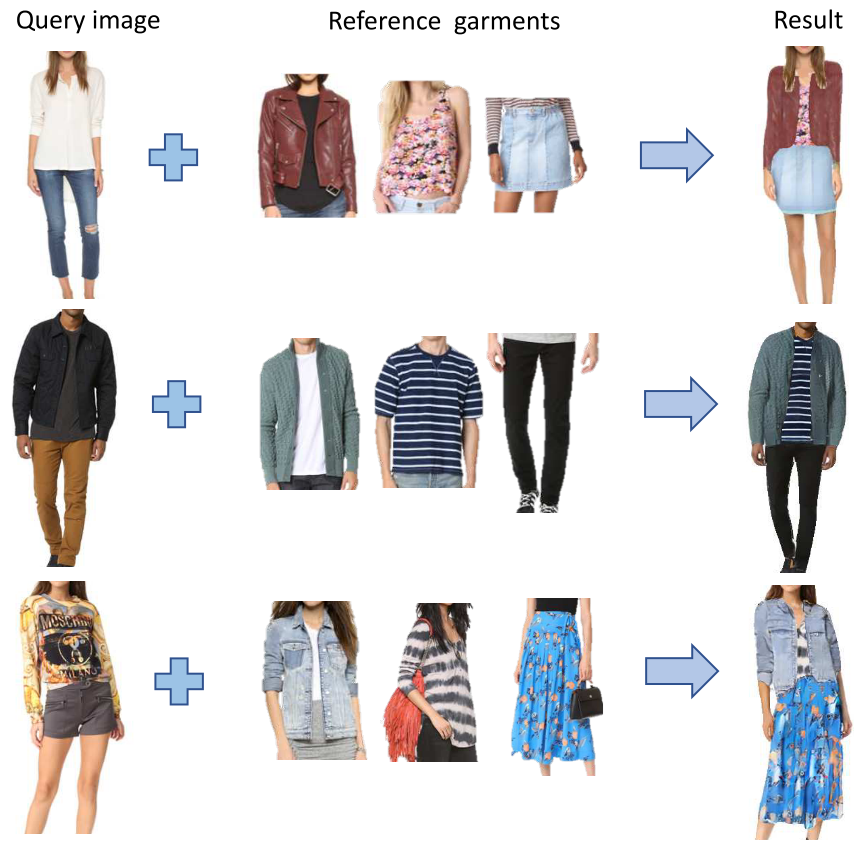
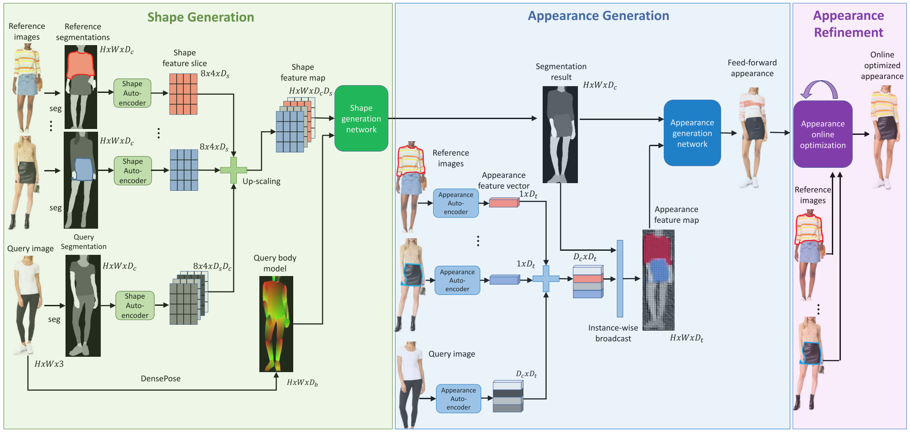
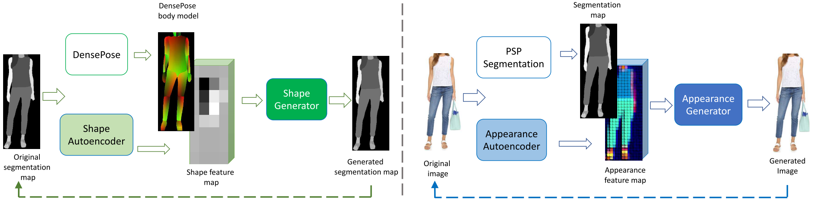

Image Based Virtual Try-On Network from Unpaired Data
=====================================

| **Authors:** Assaf Neuberger, Eran Borenstein, Bar Hilleli, Eduard Oks, Sharon Alpert
| **Affiliations:** Amazon Lab126

This paper presents a new image-based virtual try-on approach (Outfit-VITON) that helps visualize how a composition of clothing items selected from various reference images form a cohesive outfit on a person in a query image. The authors provide an inexpensive data collection and training process, and introduce an online optimization capability for virtual try-on that accurately synthesizes fine garment features.

Outfit Virtual Try-On (O-VITON)
-------------------------------------

This system uses multiple reference images of people wearing garments varying in shape and style.

Similar to the Pix2PixHD approach, the generator :math:`G` is conditioned on a semantic segmentation map and on an appearance map generated by an encoder :math:`E`. The autoencoder assigns to each semantic region in the segmentation map a low-dimensional feature vector representing the region appearance. These appearance-based features enable control over the apperance of the output image and address the lack of diversity.

O-VITON consists of three main steps:
  1. Generating a segmentation map that consistently combines the sihouttes (shape) of the selected reference garments with the segmentation map of the query image.
  2. Generating a photo-realistic image dressed with the garments selected from the reference images.
  3. Online optimization to refine the appearance of the final output image.

Feed-Forward Generation
-------------------------------------

The inputs of the system are:
  - a :math:`H \times W` query image :math:`x^0`
  - a set of :math:`M` :math:`H \times W` reference images :math:`(x^1, \dots, x^M)`

A PSP semantic segmentation network :math:`S` is trained which outputs :math:`s^m = S(x^m)` of size :math:`H \times W \times D_c`. Here class :math:`c` can be a body part such as face or right arm, or a garment type such as tops, pants, jacket or background. Further a DensePose network is applied to estimate a body model :math:`b = B(x^0)` of size :math:`H \times W \times D_b`.

**Shape generation:** The shape-generation network combines the body model :math:`b` with the shapes of the selected garments :math:`\{s^m\}_{m=1}^M`. A shape encoder :math:`E_{shape}` followed by a local pooling step maps this mask to a shape feature slice :math:`e_{m, c}^8 = E_{shape}(M_{m, c})` of :math:`8 \times 4 \times D_s` dimensions. By concatenating them along the depth dimension, we get a coarse shape feature map :math:`\bar{e}^s` of :math:`8 \times 4 \times D_s \times D_c` dimensions, and the up-scaled version :math:`e^s` of :math:`H \times W \times D_sD_c` dimensions. The shape feature map :math:`e^s` and the body model :math:`b` are fed into the shape generator network :math:`G_{shape}` to generate a new, transformed segmentation map :math:`s^y` of the query person wearing the selected reference garments :math:`s^y = G_{shape}(b, e^s)`.

**Appearance generation:** An appearance autoencoder :math:`E_{app}(x^m, s^m)` is applied to the RGB images and their segmentation maps :math:`(x^m, s^m)`. The output is denoted as :math:`\bar{e}_m^t` of :math:`H \times W \times D_t` dimensions. By region-wise average pooling according to the mask :math:`M_{m, c}` they form a :math:`D_t` dimensional vector :math:`e_{m, c}^t`. The appearance generator :math:`G_{app}` takes the segmentation map :math:`s^y` and the appearance featuer map :math:`e^t` as the condition and generates an output :math:`y` representing the feed-forward virtual try-on output :math:`y = G_{app}(s^y, e^t)`.

Train Phase
-------------------------------------

Online Optimization
-------------------------------------

There are two remaining issues:
  1. Less frequent garments with non-repetitive patterns are more challenging due to both their irregular pattern and reduced representation.
  2. No matter how big the training set is, it will never be sufficiently large to cover all possible garment pattern and shape variations.
