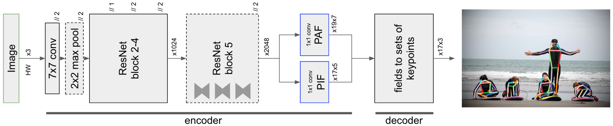
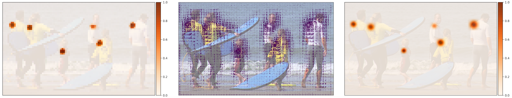
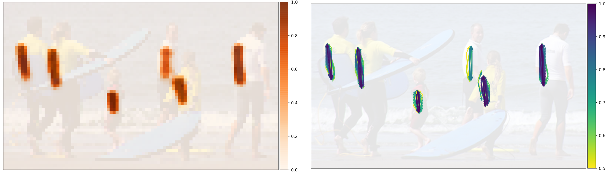

PifPaf: Composite Fields for Human Pose Estimation
=====================================

| **Authors:** Sven Kreiss, Lorenzo Bertoni, Alexandre Alahi
| **Affiliations:** EPFL VITA lab, CH-1015 Lausanne

The authors propose a new bottom-up method for multi-person 2D human pose estimation, known as PifPaf. This method uses a Part Intensity Field (PIF) to localize body parts and a Part Association Field (PAF) to form human poses. It outperforms previous methods at low resolution and in crowded, cluttered and occluded scenes thanks to (i) the composite filed PAF encoding fine-grained information and (ii) the choice of Laplace loss for regression which incorporates a notion of uncertainty. PifPaf achieves SOTA results on the standard COCO keypoint task and a modified COCO keypoint task for the transportation domain.

The authors propose to extend the notion of fields in pose estimation to go beyond scalar and vector fields to **composite fields**. They introduce a new neural network architecture with two head networks. For each body part or joint, one head network predicts the confidence score, the precision and the size of this joint, which we call a Part Intensity Field (PIF). The other network predicts association between parts, called the Part Association Field (PAF), which is of a new composite structure.

The goal of this method is to estimate human poses in crowded images. The authors address challenges related to low-resolution and partially occluded pedestrians. The figure below presents the PifPaf model.

Part Intensity Fields (PIF)
-------------------------------------

PIF detect and precisely localize body parts. It has composite structure including

- a scalar component for confidence: :math:`c`
- a vector component that points to the closest body part: :math:`(x, y)` with spread :math:`b`
- a scalar component for the size of the joint: :math:`\sigma`

More formally, we have :math:`\mathbf{p}^{ij} = \{p_c^{ij}, p_x^{ij}, p_y^{ij}, p_b^{ij}, p_\sigma^{ij}\}`. The confidence map of a PIF is very coarse. However, we can recover a high resolution confidence map :math:`f(x, y)` using the other components:

.. math::

   f(x, y) = \sum_{ij} p_c^{ij} \mathcal{N}(x, y \mid p_x^{ij}, p_y^{ij}, p_\sigma^{ij})

This equation emphsizes the gird-free nature of the localization. The figure below visualizes the components of the PIF for the left shoulder.

Part Association Fields
-------------------------------------

PAF connects joint locations together into poses. At every location, PAFs predict a confidence, two vectors to the two parts this association is connecting and two widths :math:`b`, represneted by :math:`\mathbf{a}^{ij} = \{a_c^{ij}, a_{x1}^{ij}, a_{y1}^{ij}, a_{b1}^{ij}, a_{x2}^{ij}, a_{y2}^{ij}, a_{b2}^{ij}\}`. Visualizations of the associations between left shoulders and left hips are shown in the figure below.

