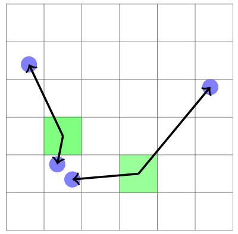

PifPaf: Composite Fields for Human Pose estimation
=====================================

| **Authors:** Sven Kreiss, Lorenzo Bertoni, Alexandre Alahi
| **Affiliations:** EPFL VITA lab, CH-1015 Lausanne

The authors propose a new bottom-up metho, PifPaf, for multi-person 2D human pose estimation. On the standard COCO keypoint task and a modified COCO keypoint task for the transportation domain, it outperforms previous SOTA methods at low resolution and performs on par at high resolution.

The goal of PifPaf is to estimate human poses in crowded images. This method is free of any grid-based constraint on the spatial localization of the joints and has the capacity to estimate multiple poses occluding each other. The figure below presents the overall model.

.. image:: figures/pifpaf-1.png
   :width: 520pt

Part Intensity Fields (PIF)
-------------------------------------

PIF detect and precisely localize body parts. It has composite structure including

- a scalar component for confidence: :math:`c`
- a vector component that points to the closest body part: :math:`(x, y)` with spread :math:`b`
- a scalar component for the size of the joint: :math:`\sigma`

More formally, we have :math:`\mathbf{p}^{ij} = \{p_c^{ij}, p_x^{ij}, p_y^{ij}, p_b^{ij}, p_\sigma^{ij}\}`. The confidence map of a PIF is very coarse. However, we can recover a high resolution confidence map :math:`f(x, y)` using the other components:

.. math::

   f(x, y) = \sum_{ij} p_c^{ij} \mathcal{N}(x, y \mid p_x^{ij}, p_y^{ij}, p_\sigma^{ij})

This equation emphsizes the gird-free nature of the localization. The figure below visualizes the components of the PIF for the left shoulder.

Part Association Fields
-------------------------------------

PAF connects joint locations together into poses. At every location, PAFs predict a confidence, two vectors to the two parts this association is connecting and two widths :math:`b`, represneted by :math:`\mathbf{a}^{ij} = \{a_c^{ij}, a_{x1}^{ij}, a_{y1}^{ij}, a_{b1}^{ij}, a_{x2}^{ij}, a_{y2}^{ij}, a_{b2}^{ij}\}`. Visualizations of the associations between left shoulders and left hips are shown in the figure below.

.. image:: figures/pifpaf-3.png
   :width: 400pt

There are 19 connections for the person class in the COCO dataset. The algorithm to construct the PAF components at a particular feature map location consists of two steps. First, find the closest joint of either of the two types which determines one of the vector components. Second, the ground truth pose determines the other vector component to represent the association. This process is illustrated below.

Adaptive Regression Loss
-------------------------------------

The authors use an L1-type loss to train regressive outputs. They further improve the localization ability of the network by injecting a scale dependence into that regression loss with the SmoothL1 or Laplace Loss.

The SmoothL1 loss allows to tune the radius :math:`r^\text{smooth}` around the origin where it produces softer gradients. For a person instance bounding box area of :math:`A_i` and keypoint size of :math:`\sigma_k`, :math:`r_{i, k}^\text{smooth}` can be set proportioanlly to :math:`\sqrt{A_i}\sigma_k`.

The Laplace loss is another L1-type loss that is attenuated via the predicted spread :math:`b`:

.. math::

   L = \lvert x - \mu \rvert / b + \log (2b)

It is independent of any estimates of :math:`A_i` and :math:`\sigma_k` and is used for all vectorial componenets.

Greedy Decoding
-------------------------------------

A new pose is seeded by PIF vectors with the highest values in the high resolution confidence map :math:`f(x, y)`. Starting from a seed, connections to other joints are added with the help of PAF fields. The algorithm is fast and greedy.

Multiple PAF associations can form connections between the current and the next joint. Given the location of a starting point :math:`\overrightarrow{x}`, the scores :math:`s` of PAF associations :math:`\mathbf{a}` are calculated with

.. math::

   s(\mathbf{a}, \overrightarrow{x}) = a_c \exp \left( - \frac{\lVert \overrightarrow{x} - \overrightarrow{a}_1 \rVert_2}{b_1} \right) f_2(a_{x2}, a_{y2})

which takes into account the confidence in this connection :math:`a_c`, the distance to the first vector's location calibrated with the two-tailed Laplace distribution probability and the high resolution part confidence at the second vector's target location :math:`f_2`. To confirm the proposed position of the new joint, they run reverse matching until a full pose is obtained. They also apply NMS at the keypoint level.

Results
-------------------------------------

In ablation study, the authors find that they can tune the performance towards smaller or larger objects by modifying the overall scale of :math:`r^\text{smooth}`.

The real improvmenet is obtained with the Laplace-based loss. By adding scale component :math:`\sigma` to the PIF filed, the AP is improved from 64.5% to 65.7%.
