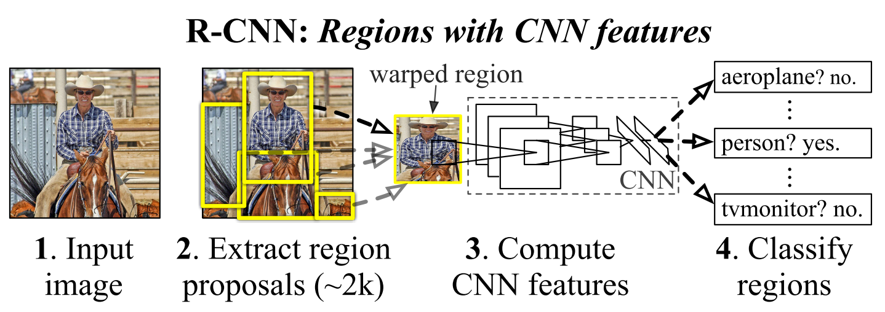

Rich Feature Hierarchies for Accurate Object Detection and Semantic Segmentation
=======================================

| **Authors:** Ross Girshick, Jeff Donahue, Trevor Darrell, Jitendra Malik
| **Affiliations:** UC Berkeley

In this paper, the authors propose a simple and scalable detection algorithm, known as R-CNN, which achieves a mAP of 53.3% on VOC 2012.

The first challenge faced in object detection is how to use the CNN features. One approach is to frame localization problem as a regression problem, but achieves limited performance. An alternative is to build a sliding-window detector. However, large receptive fields make the precise localization difficult. Instead, the authors propose to solve the CNN localization problem by operating within the "recognition using regions" paradigm, as depicted in the figure below.

The second challenge is that labeled data is scarce and the amount currently available is insufficient for training a large CNN. The authors show that the "supervised pre-training followed by domain-specific fine-tuning" paradigm is quite effective.

The authors also note that R-CNN can be easily extend to the task of semantic segmentation with competitive results.

Object Detection with R-CNN
-------------------------------------

R-CNN consists of three modules:

* **Category-independent region proposals:** There are a variety of region proposal methods. The authors use selective search for controlled comparison with prior detection work.
* **Feature extraction with CNN:** Image regions are warpped to :math:`227 \times 227` pixel size and then a 4096-dimensional feature vector is extracted using CNN.
* **Class-specific linear SVMs**

At test time, the authors run selective search on the test image to extract around 2000 region proposals. They warp each proposal and forward propogate it through the CNN to compute features. Then, for each class, they score each feature vector using the SVM trained for that class. Finally a greedy NMS is applied.

.. note:: Why training SVMs rather than using the outputs from the final softmax layer of the fine-tuned CNN?

   The positive and negative examples are defined differently for fine-tuning the CNN versus training the SVMs:

   - **fine-tuning CNN:** positive if IoU is at least 0.5 and negative otherwise
   - **traning SVMs:** positive if IoU is 1.0, negative if IoU smaller than 0.3, and ignored otherwise
   
   If the definition of positives and negatives in training SMVs is applied to fine-tuning CNN, there is a significant drop in model performance. One hypothesis is that the criterion used for training SVMs does not generate enough positive samples for fine-tuning the CNN due to the limited fine-tuning data.

   However, even with the carefully-selected positive/negative definitions for fine-tuning the CNN, there is still a gap between the performance of the softmax outputs (50.9% mAP) and the trained SVMs (54.2% mAP). The authors conjecture that with some additional tweaks to fine-tuning this performance gap may be closed.

**Bounding box regression:** Based on the error analysis, the authors train a linear regression model to predict a new detection window given the features for a selective search region proposal. Results show that this simple approach could boost mAP by 3 to 4 points.
