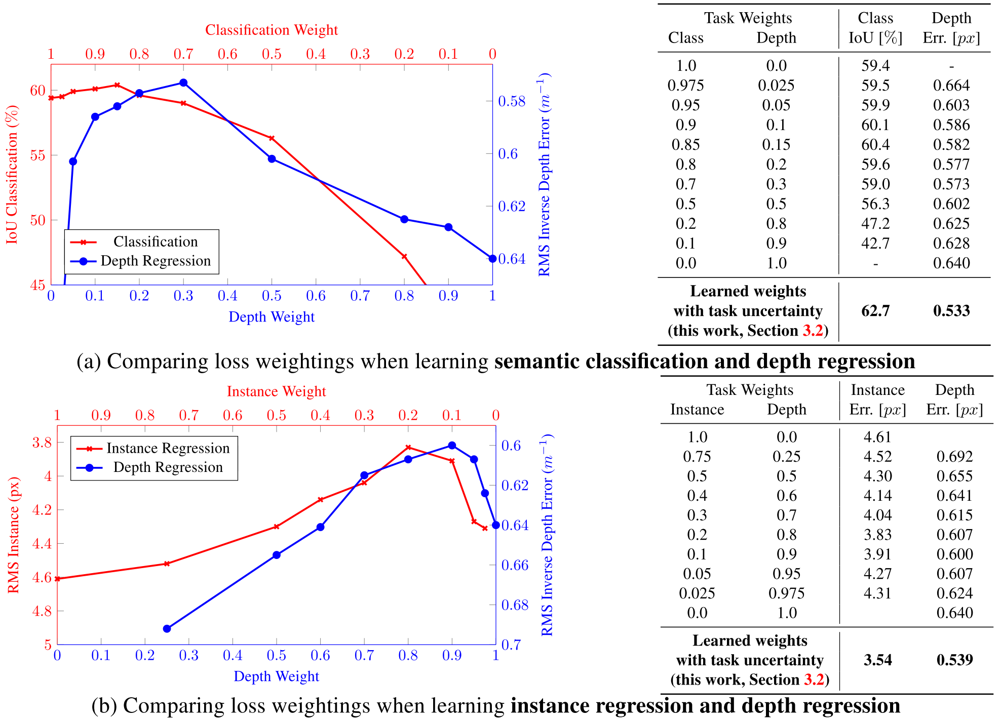

Multi-Task Learning Using Uncertainty to Weigh Losses for Scene Geometry and Semantics
=====================================

| **Authors:** Alex Kendall, Yarin Gal, Roberto Cipolla
| **Affiliations:** University of Cambridge, University of Oxford

Multi-task learning aims to improve learning efficiency and prediction accuracy by learning multiple objectives from a shared representation. Prior approaches to simultaneously learning multiple tasks use a naive weighted sum of losses. The authors show that performance is highly dependent on an appropriate choice of weighting between each task's loss. They observe that the optimal weighting of each task is dependent on the measurement scale and ultimately the magnitude of the task's noise.

In this work they propose a principled way of combinining multiple loss functions to simultaneously learn multiple objectives using homoscedastic uncertainty. They interpret homoscedastic uncertainty as task-dependent weighting and show how to derive a principled multi-task loss function which can learn to balance various regression and classification losses.

The authors demonstrate their method in jointly learning semantic segmentation, instance segmentation, and pixel-wise metric depth from a monocular image. Results show that this method can learn to balance the weightings optimally, resulting in superior performance, compared with learning each task individually.

Homoscedastic Uncertainty as Task-Dependent Uncertainty
-------------------------------------

In Bayesian modelling, there are two main types of unceratinty one can model:

- **Epistemic uncertainty** is uncertainty in the model which captures what our model does not know due to lack of training data, and can be explained away with increased training data.
- **Aleatoric uncertainty** captures our uncertainty with respect to information which our data cannot explain, and can be explained away with the ability to observe all explanatory variables with increasing precision.
    * **Data-dependent** or **Heteroscedastic uncertainty** is aleatoric uncertainty which depends on the input data and is predicted as a model output.
    * **Task-dependent** or **homoscedastic uncertainty** is aleatoric uncertainty which is not dependent on the input data. It is not a model output, rather it is a quantity which stays constant for all input data and varies between different tasks.

Multi-Task Likelihoods
-------------------------------------

In this section the authors derive a multi-task loss function based on maximising the Gaussian likelihood with homoscedastic uncertainty.

Let :math:`\mathbf{f}^\mathbf{W}(\mathbf{x})` be the output of a neural network. We define the following probabilistic model:
    - **regression:** we define likelihood as a Gaussian with mean given by the model output:

      .. math::

         p\left(\mathbf{y} \mid \mathbf{f}^\mathbf{W}(\mathbf{x})\right) = \mathcal{N}\left( \mathbf{f}^\mathbf{W}(\mathbf{x}), \sigma^2 \right)
    
      with an observation noise scalar :math:`\sigma`
    - **classification:** we squash the model output through a softmax function, and sample from the resulting probability vector:

      .. math::

         p\left(\mathbf{y} \mid \mathbf{f}^\mathbf{W}(\mathbf{x})\right) = \text{Softmax}\left( \mathbf{f}^\mathbf{W}(\mathbf{x}) \right)

We define :math:`\mathbf{f}^\mathbf{W}(\mathbf{x})` as our **sufficient statistics** and obtain:

.. math::

   p\left(\mathbf{y}_1, \dots, \mathbf{y}_K \mid \mathbf{f}^\mathbf{W}(\mathbf{x})\right) = p\left(\mathbf{y}_1 \mid \mathbf{f}^\mathbf{W}(\mathbf{x})\right) \dots p\left(\mathbf{y}_K \mid \mathbf{f}^\mathbf{W}(\mathbf{x})\right)

In maximium likelihood inference, we maximise the log likelihood of the model.

.. warning::

   Some derivations are skipped here.

Assume that a model's multiple outputs are composed of a continuous output :math:`\mathbf{y}_1` and a discrete output :math:`\mathbf{y}_2`, modelled with a Gaussian likelihood and a soft-max likelihood, respectively. The joint loss, :math:`\mathcal{L}(\mathbf{W}, \sigma_1, \sigma_2)`, is given as

.. math::

   \mathcal{L}(\mathbf{W}, \sigma_1, \sigma_2) & = -\log (\mathbf{y}_1, \mathbf{y}_2=c \mid \mathbf{f}^\mathbf{W}(\mathbf{x})) \\
   & = -\log \mathcal{N}(\mathbf{y}_1; \mathbf{f}^\mathbf{W}(\mathbf{x}), \sigma_1^2) \cdot \text{Softmax}(\mathbf{y}_2=c; \mathbf{f}^\mathbf{W}(\mathbf{x}), \sigma_2) \\
   & = \frac{1}{2\sigma_1^2} \lVert \mathbf{y}_1 - \mathbf{f}^\mathbf{W}(\mathbf{x}) \rVert^2 + \log\sigma_1 - \log p(\mathbf{y}_2 = c \mid \mathbf{f}^\mathbf{W}(\mathbf{x}), \sigma_2) \\
   & \approx \frac{1}{2\sigma_1^2} \mathcal{L}_1(\mathbf{W}) + \frac{1}{\sigma_2^2}\mathcal{L}_2(\mathbf{W}) + \log\sigma_1 + \log\sigma_2

where :math:`\mathcal{L}_1(\mathbf{W}) = \lVert \mathbf{y}_1 - \mathbf{f}^\mathbf{W}(\mathbf{x}) \rVert^2` and :math:`\mathbf{L}_2(\mathbf{W}) = -\log\text{Softmax}(\mathbf{y}_2, \mathbf{f}^\mathbf{W}(\mathbf{x}))`.

The last objective can be seen as learning the relative weights of the losses for each output. :math:`\sigma_i` controls the contribution of :math:`\mathcal{L}_i`, and at the same time regularized by :math:`\log\sigma_i`.

In practice, the authors train the network to predict the log variance, :math:`s = \log \sigma^2`.

Results
-------------------------------------

